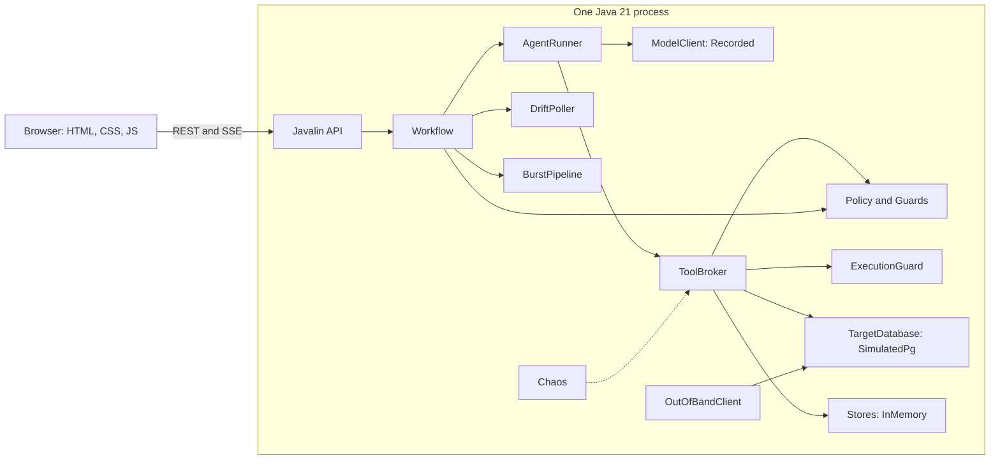
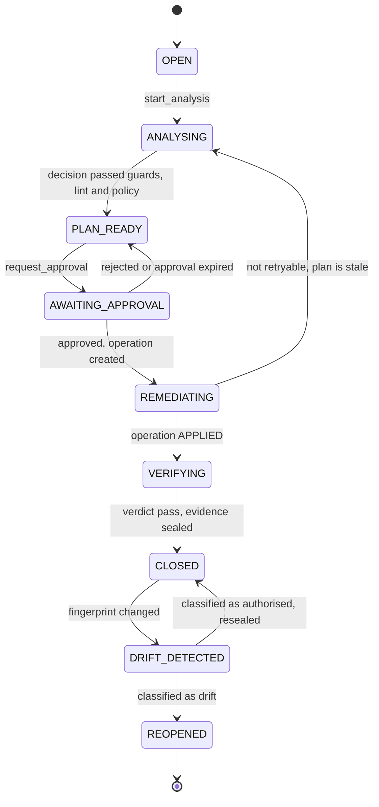
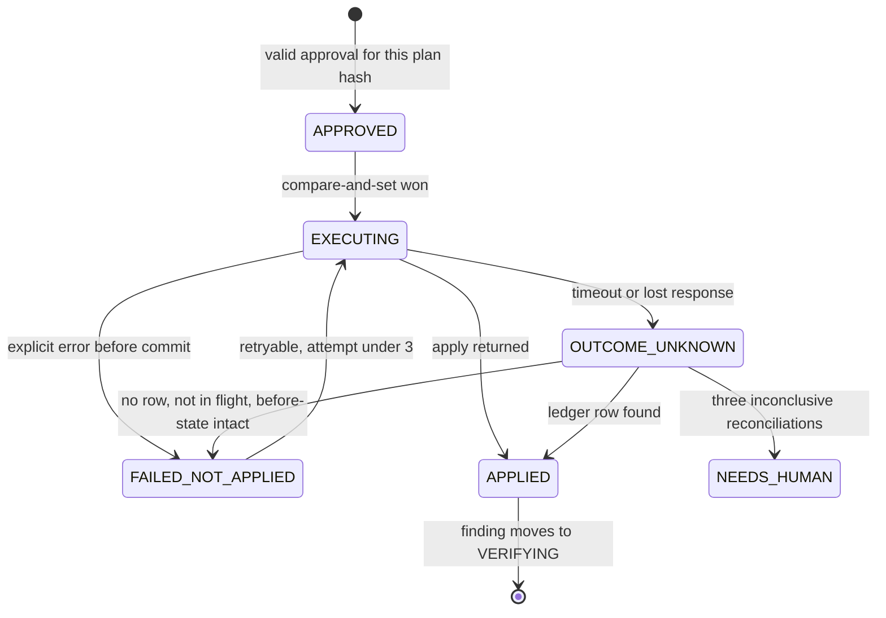
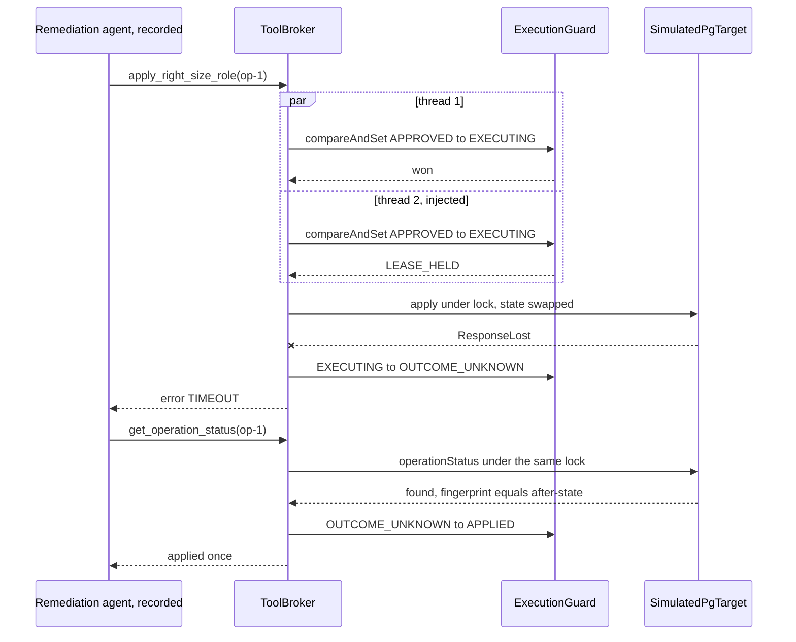
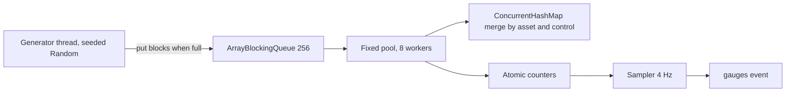

# D0 prototype design

## Summary

The prototype is one Java 21 process with Javalin and a vanilla web page: everything lives in memory, the PostgreSQL target is a labelled simulation, agent responses are labelled recordings, and every tool call, guard, policy check, state transition and fault path executes for real.

|  | Production-path design | D0 prototype |
| --- | --- | --- |
| Runtime | Go orchestrator, simulator sidecar | One Java 21 fat JAR, Javalin, no sidecar |
| Model | Live calls, key in Secret Manager | Recorded responses behind `ModelClient`, labelled. No key, no secret. |
| Target | Cloud SQL PostgreSQL 16, per-session database and roles | `SimulatedPgTarget` behind `TargetDatabase`, labelled. Roles, memberships, grants, transactions, a lock and a ledger, in memory. |
| State | Platform database | One in-memory `Session` object per reviewer, seeded from JSON resources |
| Hosting | Cloud Run always-on, Cloud SQL, private networking | Cloud Run, scale to zero, maximum one instance, public, nothing else |
| Cost | An always-on instance plus a database, billed monthly | Expected to stay inside Cloud Run's free tier at reviewer volumes |
| UI | React | One HTML file, one stylesheet, one script, `EventSource` |

**What does not change.** Agents propose and deterministic code decides. Write tools take a reference, never parameters. An approval binds to a plan hash. The change and its idempotency marker commit together. A compare-and-set lease picks one executor. A timeout after commit becomes `OUTCOME_UNKNOWN` and can be left only through reconciliation. Verification results are computed before the verifier agent sees them. Drift is detected by a deterministic poll. The UI shows agent decisions, deterministic enforcement and human approval in three distinct visual forms.

**Scope decision.** Complete D0 is what gets built: build-plan steps 1 to 12, with the whole test suite as the Definition of Done. The plan's time figures are estimates for one engineer working from this spec with an AI coding assistant, and its two lines are checkpoints, not scope options. Nothing in the production-path tab is needed for D0.

## D0 prototype versus future production

Each capability is either real, simulated with a label, or deferred; nothing is simulated silently.

| Capability | In D0 | Status | Future production | Extension point |
| --- | --- | --- | --- | --- |
| Agent reasoning | Recorded responses, selected turn by turn from live tool results | Simulated, labelled | Live model calls | `ModelClient` |
| Tool calls, allowlists, argument validation | Execute on every run | Real | Same | None needed |
| Policy, plan lint, plan hash, approval binding, separation of duties | Execute on every run | Real | Same, policy engine later | `policy.json` |
| Guards: completeness, justification, scenario coverage, verdict, reopen legality | Execute on every run | Real | Same | None needed |
| PostgreSQL target | In-memory model of roles, memberships, grants, transactions, lock and ledger | Simulated, labelled | Cloud SQL or any PostgreSQL 16 through JDBC and the definer functions | `TargetDatabase` |
| Transactional change with idempotency marker | Atomic state swap inside the simulated target | Real logic on a simulated engine | One SQL transaction | `TargetDatabase.apply` |
| Duplicate delivery, lease, one mutation effect | Two racing threads, compare-and-set, ledger check under lock | Real | Same, with database-backed state | `Stores` |
| Pre-commit failure, lost response, `OUTCOME_UNKNOWN`, reconciliation | Injected at the adapter boundary, recovered by the real state machine | Real | Same | None needed |
| Verification: assertions, negative probe, health scenarios | Evaluated against the simulated privilege engine | Real logic on a simulated engine | Catalog queries and an application simulator | `TargetDatabase`, `Stores` |
| Drift detection and supervision | Scheduled fingerprint poll, out-of-band change through a separate client | Real | Same | None needed |
| Bounded concurrency | 5,000 findings through a 256-slot queue and 8 workers, live gauges | Real | Same | None needed |
| Retrieval | Keyword and metadata scoring over a small in-memory corpus | Real, small | PostgreSQL full-text or vectors | `Stores` |
| Telemetry, job history, audit feed | JSON resources loaded per session | Seeded, labelled | Real pipelines | `Stores` |
| Timeline and evidence | Append-only list, JSON export | Real, in memory | Insert-only table, anchoring, retention | `Stores` |
| Sessions | In-memory map, cookie, 30-minute expiry, reset | Real, single instance | Per-session databases and roles | `Stores` |

**Deferred outright, with no stub:** live model mode, Cloud SQL, Secret Manager, invites and spend caps, warm pool, sidecar, row-level security, rollback execution, human plan edits, run resume after a crash, cross-instance fan-out, operator page, nightly live-quality suite.

**The label.** A persistent banner reads: "Prototype: recorded agent responses, a simulated PostgreSQL target and demo personas. Tools, policy, guards, workflow and fault handling run live." Every decision card carries a "recorded" tag, every piece of target evidence carries the source label "Simulated PostgreSQL", and every approval carries "demo persona, not authenticated". All three also appear in the evidence export.

## Stack evaluation: Java, Javalin, vanilla web

Java 21 with Javalin is a good fit for this prototype, provided the JVM is tuned for a small footprint and nothing heavier than Javalin and Jackson is added.

| Criterion | Assessment | Verdict |
| --- | --- | --- |
| Speed of build | Javalin gives routing, static files, JSON and Server-Sent Events in one dependency with almost no ceremony. Records, sealed interfaces and pattern-matching `switch` make state machines and typed tool arguments short and safe. | Strong |
| Concurrency story | The demo's invariants map directly to `java.util.concurrent`: `AtomicReference.compareAndSet` for the lease, `ReentrantLock.tryLock` with a timeout for the target lock, `ArrayBlockingQueue` and a fixed pool for the burst, `Semaphore` for agent slots, `CountDownLatch` to make two deliveries truly race. A reviewer can read these in the code. | Strong, arguably better for the systems story than Go's channels |
| Memory | A tuned JVM running Javalin and Jetty should sit near 120 to 170 MB resident. That is an estimate to measure. It is higher than the Go design's estimate and still under the PRD's 256 MB budget. | Acceptable |
| Start-up | A few seconds cold on Cloud Run with startup CPU boost, mostly JVM and Jetty start. Matters because the service scales to zero. | Acceptable. Show a "waking up" line on first paint. |
| Deployment | One fat JAR in a slim JRE image. No native compilation. | Simple |
| Vanilla HTML, CSS, JavaScript | One screen, one event stream, a reducer and a dozen render functions. No build step, no bundler, served from the JAR. | Right-sized. A framework would cost more time than it saves here. |

**Settings that make it fit**

```text
Java 21 LTS, current stable Javalin, Jackson, slf4j-simple. Nothing else.
JVM: -XX:+UseSerialGC -Xms32m -Xmx128m -Xss512k -XX:MaxMetaspaceSize=96m
     -XX:TieredStopAtLevel=1 -XX:+ExitOnOutOfMemoryError
Image: eclipse-temurin 21 JRE on Alpine, or a distroless Java 21 base
```

**What to avoid**, because each would break the time or memory budget: Spring Boot, a dependency-injection container, an ORM or embedded database, GraalVM native image, a JSON Schema library, a YAML parser, a front-end framework or bundler.

**Two Javalin and Jackson details to get right.** Since Javalin 5, an SSE client is closed when its handler returns unless `SseClient.keepAlive()` is called, so the handler must call it and keep the client in the session's subscriber list. Jackson's strict settings reject unknown fields but not missing, null or blank ones, so every record validates itself explicitly. See Input validation.

**Honest trade-off.** Go would use less memory and start faster. Java wins if it is the engineer's fastest language, because engineer speed is the binding constraint at two to three hours. The three interfaces in the next section keep the choice reversible.

## Architecture and extension points

One process, about fifteen classes, and three interfaces that mark exactly where production replaces the prototype.



`AgentRunner` can reach only `ModelClient` and `ToolBroker`. `OutOfBandClient` reaches the target without touching the broker, which is what makes the drift change genuinely out of band inside one process.

**Packages**

| Package | Classes | Size guide |
| --- | --- | --- |
| `app` | `Main`, `Api`, `SessionRegistry`, `Sse` | 150 lines |
| `domain` | Records: `Finding`, `Plan`, `PlanExec`, `Approval`, `Operation`, `Evidence`, `Decision`, `TimelineEvent`. Enums for states. | 120 lines |
| `workflow` | `Workflow`, `ApprovalService`, `ExecutionGuard`, `DriftPoller`, `BurstPipeline` | 300 lines |
| `agents` | `AgentRunner`, `ModelClient`, `RecordedModelClient` | 120 lines |
| `broker` | `ToolBroker`, `Tools`, `Policy`, `Guards`, `PlanHash` | 300 lines |
| `target` | `TargetDatabase`, `SimulatedPgTarget`, `PgState`, `OutOfBandClient`, `AppSimulator` | 300 lines |
| `stores` | `Stores`, `InMemoryStores`, `Seed` | 150 lines |
| `chaos` | `Chaos` | 40 lines |
| `resources` | `policy.json`, `seed/*.json`, `recordings/*.json`, `public/` | Data |

About 1,500 lines of Java and 400 of JavaScript. That size is why the time budget is tight but not absurd.

**The three extension interfaces**

```text
interface ModelClient {
  Turn next(AgentId agent, Phase phase, Trigger trigger, RunContext ctx);   // D0: RecordedModelClient. Later: LiveModelClient.
}

interface TargetDatabase {
  RoleSnapshot snapshot(Caller as, String role);
  String       fingerprint(Caller as, String role);
  CatalogObject describe(Caller as, String schema, String name, Kind kind);
  Preflight    preflight(Caller as, PlanExec exec);
  ApplyResult  apply(Caller as, UUID operationId, PlanExec exec, CommitHook hook);   // one transaction
  StatusResult operationStatus(Caller as, UUID operationId);                          // takes the same lock
  void         grantMembership(Caller as, String role, String member);                // used only by OutOfBandClient
  ProbeResult  attempt(Caller as, String role, SqlAction action);                     // privilege check, returns SQLSTATE
}                                                                                     // D0: SimulatedPgTarget. Later: JdbcPostgresTarget.

interface Stores {
  Timeline timeline(); Findings findings(); Operations operations(); Plans plans(); Approvals approvals();
  EvidenceLog evidence(); Corpus corpus(); Telemetry telemetry(); AuditFeed audit();   // D0: InMemoryStores. Later: PostgresStores.
}
```

`Caller` carries the simulated database identity, such as `agent_analysis` or `agent_remediator`. The target checks it on every call, so per-agent permissions are enforced by the target as well as by the broker allowlist. `CommitHook` is how `Chaos` reaches the two seams inside `apply` without the target knowing about demos.

## Behavioural invariants preserved

Twelve invariants define the product's behaviour; the prototype keeps all twelve and changes only the machinery underneath them.

| # | Invariant | Production mechanism | D0 mechanism | Proved by |
| --- | --- | --- | --- | --- |
| I1 | An agent can act only through allowlisted tools | Broker allowlist, database roles | Broker allowlist, `Caller` check in the target | Test: each agent calls a foreign tool and is refused |
| I2 | No model-authored value becomes a write parameter | Write tools take `operation_ref`. Broker loads the approved plan. | Identical | Test: extra argument rejected by strict deserialisation |
| I3 | Nothing executes without policy allow and a valid approval bound to the plan hash | Policy evaluator, approval service, transition T1 | Identical logic, in memory | Test: expired, voided and mismatched approvals refused |
| I4 | The requester cannot approve | Approval service | Identical | Shown in the guided run |
| I5 | One mutation effect per approved plan under duplicate delivery | Unique operation, compare-and-set lease, ledger under advisory lock | `ConcurrentHashMap.putIfAbsent`, `AtomicReference.compareAndSet`, ledger check under `ReentrantLock` | Test: two threads released by a latch, 100 iterations, ledger size 1 |
| I6 | The change and its marker commit or vanish together | One SQL transaction | One atomic swap of an immutable `PgState` | Test: abort before commit leaves state and ledger unchanged |
| I7 | An explicit pre-commit error is `FAILED_NOT_APPLIED` and is safely retryable | Outcome classification | Identical table | Test, and explore switch |
| I8 | A lost response is `OUTCOME_UNKNOWN`, and the write tool is refused until reconciled | Broker precondition `RECONCILE_REQUIRED` | Identical | Shown in the guided run, and tested |
| I9 | Reconciliation never reads an in-flight write | Status takes the same advisory lock | Status takes the same `ReentrantLock` | Test: hold the write open, status waits |
| I10 | The verifier cannot pass what the checks failed | Verdict guard over stored results | Identical | Test: forced assertion failure |
| I11 | Drift is detected deterministically and reopens as a linked finding | Catalog fingerprint poll, supervisor decision | Fingerprint poll over `PgState`, recorded supervisor decision, live guard | Shown in the guided run |
| I12 | Concurrency and memory are bounded by constants | Channel 256, 8 workers, semaphore 2 | `ArrayBlockingQueue(256)`, 8 threads, `Semaphore(2)` | Shown live on gauges, and tested |

One invariant is new to D0: **I13, nothing simulated is unlabelled.** The banner, the "recorded" tag on decision cards, the "Simulated PostgreSQL" source label and the matching fields in the evidence export are checked by a test that scans the export.

A second addition from review: **I14, a finding moves only along its legal transition table.** Each move is a compare-and-set with its timeline event, only the workflow performs it, and `REMEDIATING` is entered only together with the creation of an operation. See Finding lifecycle.

Four more from the second review round:

| # | Invariant | D0 mechanism | Proved by |
| --- | --- | --- | --- |
| I15 | Every reachable agent trigger has a recorded response, and a miss stops safely | `RecordingValidator` and the golden-flow self-check before the port opens. `RECORDING_MISS` leads to reconciliation if needed, then `NEEDS_ATTENTION` with a friendly panel. | `recordingsCoverEveryRequiredTrigger`, `recordingMissStopsSafely` |
| I16 | Under duplicate delivery the agent receives the lease winner's result, and the loser is recorded separately | `raceLease`: only the lease step is raced, events appended after the join in fixed order | `duplicateDeliveryAppliesOnce`, extended |
| I17 | Reset happens only from a stable state | `busy(session)` checked under the session's command lock | `resetRefusedWhileBusy` |
| I18 | Missing, null and blank inputs are refused by explicit code before any guard, lock or target call | `Require` in every record constructor, broker step 3 | `missingNullBlankInputsAreRefused` |

Invariant I13 now also covers identity: every approval is labelled as a demo persona, not authenticated.

Three more from the third review round:

| # | Invariant | D0 mechanism | Proved by |
| --- | --- | --- | --- |
| I19 | A subscriber never misses a timeline event, and no browser write happens under a lock | Backlog copy and registration share the timeline lock with `appendAll`. Sends run on the subscriber's own thread from its queue. | `subscribeDuringAppendsSeesEverySeqOnce`, `slowSubscriberDoesNotBlockAppend` |
| I20 | Reopen is all or nothing | One `Lifecycle.transition` whose effects create the child, move the active pointer and return the events | `reopenIsAtomic` |
| I21 | Every lifecycle move, including drift, goes through `Lifecycle.transition` | `Findings.casState` is package-private with one caller | `onlyLifecycleMovesFindings`, `driftUsesCommonTransition` |

I14 is tightened accordingly: there is no second code path that can move a finding.

Two refinements from the fourth review round. I19 now rests on a backlog that is separate from the bounded live queue, so a large replay cannot overflow it. And a new invariant: **I22, after a reset every browser attached to the old session reloads onto the new timeline from sequence zero.** The mechanism is the session epoch, the final `session.reset` event and the `session.stale` reply. It is proved by `resetHandsSubscribersToNewTimeline`.

## Simulated PostgreSQL target

`SimulatedPgTarget` models only the slice of PostgreSQL this finding touches: roles, memberships, ownership, grants, a privilege check, a transaction and a lock. It is honest about being a model, and it is strict enough that a wrong plan really fails.

**State.** One immutable record held in an `AtomicReference`, plus one `ReentrantLock` standing in for the advisory lock.

```text
record PgState(
  Map<String, Role> roles,                 // name, canLogin, attributes
  Set<Membership> memberships,             // role, member, grantor, adminOption
  Map<String, DbObject> objects,           // schema | table | function; owner; for functions: publicExecute, requires[]
  Set<Grant> grants,                       // grantee, privilege, object
  Map<UUID, LedgerRow> ledger,             // operationId -> planHash, before, after, appliedGrants
  Set<String> appliedPlanHashes)
```

**Privilege rule**, used by every probe and scenario. `attempt(role, action)` returns `ok` or SQLSTATE `42501`:

1. Effective roles are the role plus everything it is a member of, transitively.
2. If an effective role owns the object, or owns the schema for a `CREATE`, the action is allowed.
3. Otherwise the action needs a direct grant of the matching privilege to an effective role, and `USAGE` on the object's schema.
4. Executing a function also evaluates its `requires` list as the caller, because `close_period` is modelled as security invoker. It requires `INSERT` on `ledger_archive` and `SELECT` on `orders`.
5. `PUBLIC` execute is false for `close_period`, matching the production seed.

Those five rules are enough for Plan v1 to genuinely fail `month_end_close` and Plan v2 to pass it. That is tested, so the retrieval moment is not staged even in the simulation.

**Seeded objects.** Schema `orders`. Tables `customers`, `orders`, `order_items`, `ledger_archive`. Function `close_period(date)`. All owned by `orders_owner`. Roles: `orders_owner`, `orders_app`, `dba_legacy`, `dba_oncall`, and the four agent callers. The finding is the seeded membership of `orders_app` in `orders_owner`, grantor `dba_legacy`.

**The transactional tool**

```text
apply(as, op, exec, hook):
  require as == agent_remediator
  if not lock.tryLock(3s): throw LockTimeout                      -> FAILED_NOT_APPLIED, retryable
  try:
    s := state.get()
    if s.ledger has op:                return alreadyApplied(s.ledger[op])
    if s.appliedPlanHashes has exec.planHash: throw PlanAlreadyApplied
    validate(exec, s)      // closed privilege list, objects exist and are owned by orders_owner,
                           // schema USAGE closure, at most 12 grants, target == configured app role
    if fingerprint(s, target) != exec.expectedBefore: throw PreconditionFailed
    draft := s.plusGrants(exec.grants).minusMembership(owner, target).plusLedger(op, exec, before, after)
    hook.beforeCommit()                // chaos may throw AbortedBeforeCommit: draft is discarded
    state.set(draft)                   // the commit: one reference swap, change and marker together
    hook.afterCommit()                 // chaos may throw ResponseLost: the caller sees a timeout
    return applied(draft)
  finally: lock.unlock()

operationStatus(as, op):
  if not lock.tryLock(3s): return inFlight
  try: s := state.get(); return { found: s.ledger has op, fingerprint: fingerprint(s, target), row: s.ledger[op] }
  finally: lock.unlock()
```

The validation list is copied from the production procedure on purpose. When `JdbcPostgresTarget` replaces this class, the checks move into the database function and the broker code does not change.

**Caller capabilities**, enforced by the target on every method:

| Caller | May call |
| --- | --- |
| `agent_analysis` | `snapshot`, `fingerprint`, `describe` |
| `agent_remediator` | `preflight`, `apply`, `operationStatus` |
| `agent_verifier` | `snapshot`, `fingerprint`, `operationStatus`, and `attempt` as `orders_app` only |
| `agent_supervisor` | `snapshot`, `fingerprint` |
| `orders_app` through `AppSimulator` | `attempt` |
| `dba_oncall` through `OutOfBandClient` | `grantMembership`, allowed because it holds admin option on `orders_owner` |

**Where the simulation is knowingly thin.** No SQL is parsed. There is no MVCC, network, connection limit or real lock manager. Grantor rules are simplified: the PostgreSQL 16 rule that a revoker needs the grantor's privileges is not modelled. Those gaps are exactly the unsafe assumptions U1 to U4 in the production-path tab, and they stay open until a real PostgreSQL target is wired in. The prototype proves the control logic, not PostgreSQL compatibility, and the banner says so.

## Session state and seeded stores

Each reviewer gets one `Session` object holding a private simulated target and private stores; reset replaces the object, and nothing survives a restart by design.

```text
class Session {
  String id; Instant expiresAt;                     // 30 minutes, sliding
  Object lock;                                      // command admission, lifecycle transitions, reopen, reset
  SimulatedPgTarget target;                         // private PgState
  InMemoryStores stores;                            // timeline, findings, plans, approvals, operations, evidence, corpus overlay, telemetry, audit
  UUID activeFindingId;                             // the finding the workbench shows; written only inside lock
  ChaosSwitches chaos; Counters counters;           // mutations, duplicates refused, refusals
  AtomicInteger activeRuns; AtomicBoolean burstRunning;
}
```

Subscribers belong to the timeline, not to the session object, because registering one must be atomic with reading the backlog.

| Concern | D0 design |
| --- | --- |
| Identity | A random session ID in an `HttpOnly`, `SameSite=Strict` cookie, minted on first visit. No invite, no login. |
| Registry | `ConcurrentHashMap<String, Session>`. At most 20 live sessions. The oldest idle session is evicted when full. A sweep every minute drops expired ones. |
| Isolation | Sessions share no mutable state. The corpus and seed files are immutable and shared. |
| Reset | Allowed only from a stable state. Builds a fresh `Session` with a new epoch, swaps it into the map, closes the old timeline with a final `session.reset` event, and the browser reloads onto the new timeline from sequence zero. See Reset gating, and Reset and the browser. |
| Restart or scale to zero | All sessions vanish. The page detects an unknown session on reconnect and offers "Start again". |
| Memory | A session is a few hundred kilobytes. The burst's deduplicated findings are capped at about 1,500 entries per session. |

**Reset gating.** Reset never has to cancel anything, because it is refused while anything is running.

```text
busy(session) = session.activeRuns > 0
             or session.burstRunning
             or any finding in session.stores.findings() is in { ANALYSING, REMEDIATING, VERIFYING, DRIFT_DETECTED }

reset allowed  <=>  not busy(session)
stable finding states: OPEN, PLAN_READY, AWAITING_APPROVAL, CLOSED, REOPENED, NEEDS_ATTENTION
```

| Rule | Detail |
| --- | --- |
| Enforced on the server | `reset` while busy returns 409 `BUSY` and appears as a gate refusal. The button state is a courtesy, not the control. |
| No race with other commands | Command admission is serialised per session with one lock. `reset` and `start_analysis` arriving together are decided in arrival order. |
| The UI always knows | `can_reset` is part of the state snapshot and is re-sent with every `finding.state_changed`, run start, run end and burst event. While false, the button is disabled with the hint "Available when the current stage finishes". |
| A stage always finishes | Every run is bounded by its step budget. Every tool call has a deadline, 8 seconds for `apply` and 3 seconds for locks. A recording miss or exhausted budget ends in `NEEDS_ATTENTION`, which is stable. So `busy` cannot stay true for more than a few tens of seconds. |
| Shared background work needs no cancellation | The drift poller and the session sweeper iterate the registry. Once a session is swapped out they simply stop seeing it. The poller takes the same session lock before it moves a finding, and rechecks that the session is still registered. |
| Backstop | If a session is ever wedged, the "Start again" link clears the cookie and mints a new session. The old one is abandoned, never cancelled. Its bounded work finishes on its own, and the sweeper evicts it at expiry. |

**Reset and the browser.** Reset replaces the `Session` object under the same cookie, so an open event stream would otherwise stay attached to the old timeline and the page would show a dead session. Every `Session` therefore has a random `epoch`, and reset hands the browser over explicitly.

```text
reset(old):
  synchronized (old.lock):
    if busy(old): return 409 BUSY
    fresh := Session.fromSeed(id = old.id, epoch = newEpoch())
    registry.put(old.id, fresh)                          // from here, Lifecycle.transition on old returns SESSION_GONE
    old.timeline.closeWith(session.reset { new_epoch })  // final event, then closed = true; no later append or subscribe succeeds
  return 200 { "reset": true, "epoch": fresh.epoch }
```

| Step | Behaviour |
| --- | --- |
| Old subscribers | Each sender thread delivers `session.reset` as its last event and closes its client. That covers every open tab on the same cookie, not only the one that pressed the button. |
| The page | On `session.reset`, or on the 200 from its own reset command, whichever arrives first, it calls `location.reload()`. A full reload discards the reducer state and the last `seq`, fetches `/api/state` for the new epoch, and opens `/api/events?epoch=<new>&after=0`. No client state is carried across. |
| A straggler | A tab that reconnects with the old epoch, including `EventSource`'s automatic reconnect with `Last-Event-ID: <old epoch>:<seq>`, receives one `session.stale` event and a close. The page reloads on `session.stale` too. A stale `after` can never be applied to the new timeline, whose `seq` restarts at zero. |
| Expiry and eviction | The same path with `session.expired`. The page shows "Start again" instead of reloading silently. |
| Restart or scale to zero | There is no old timeline to send a final event. The page's `/api/state` call returns a new epoch, it sees the mismatch with the one it holds, and it shows "The demo restarted. Start again", which reloads the page. This matches the operational table under Build, run and deploy. |

**Seed files**, under `resources/seed`, loaded once at start-up and copied per session:

| File | Contents | Source label in the UI |
| --- | --- | --- |
| `pg-state.json` | Roles, memberships, objects, grants for the simulated target | Simulated PostgreSQL |
| `finding.json`, `asset.json` | The one finding, its owner, application, PII label, criticality | Platform record |
| `telemetry.json` | 14 days of statement shapes per role: object, command, calls, `last_seen_days_ago` | Seeded demo telemetry |
| `job-runs.json` | Scheduled jobs, including month-end close 19 days ago | Seeded demo telemetry |
| `audit.json` | Role-change history. The drift switch appends to the session's copy. | Simulated audit feed |
| `corpus.json` | 8 documents: runbook RB-07, outcomes OUT-0212 (rolled back), OUT-0198 (success), OUT-0231 (poisoned body), and four distractors | Knowledge corpus |
| `fleet.json` | 60 synthetic assets and 25 controls for the burst | Platform record |

The corpus shrinks from 52 documents to 8. Eight is enough for ranking, a conflicting success, distractors and the injection test, and it can be authored in minutes.

**Timeline.** `InMemoryStores.timeline()` exposes `append`, `appendAll`, `read` and `subscribe`. There is no update or delete method to call. `appendAll` assigns consecutive `seq` numbers under one acquisition of the timeline lock, which is what lets a transition and its side effects appear as one uninterrupted group. State-changing store methods are only ever called from inside `Lifecycle.transition` or the execution guard, with their events appended in the same critical section. That is the in-memory equivalent of "same transaction".

**Lock order.** Two locks per session: `session.lock`, then the timeline's own lock. Code holding the timeline lock never takes `session.lock`, and no network write happens under either.

## Tool broker, policy and guards

The broker keeps the production pipeline's order and refusals, implemented as one Java method of about sixty lines, so that recorded agents are constrained exactly as live ones would be.

**Pipeline**

```text
invoke(run, call):
  1 tool := Tools.get(call.name);           refuse TOOL_NOT_ALLOWED unless run.agent in tool.agents
  2 refuse KILLED if session.killSwitch and tool.kind != READ
  3 args := Inputs.parse(call.args, tool.argsRecord)             // strict Jackson, then explicit missing, null and blank checks -> INVALID_ARGS
  4 resolve operation_ref / finding_ref in this session;         refuse UNKNOWN_REF
  5 refuse PROTECTED_TARGET if a named role is in policy.protectedRoles
  6 tool.precondition(state):                                    refuse STATE_CONFLICT | LEASE_HELD | RECONCILE_REQUIRED
  7 decision := Policy.evaluate(tool, args, state);              append gate event; refuse POLICY_DENIED
  8 if duplicate delivery was armed, step 6 was raced by two invocations; only the lease winner reaches this point
  9 result := tool.handler(target as tool.caller, stores, args)  // write tools load PlanExec by plan hash, never from args
  10 evidence := stores.evidence().add(tool, sourceLabel, result); append tool event
  11 return { evidence_id, source_label, data }  or  { error: { code, message, retryable, next_allowed_tools } }
```

**Tools in D0.** The catalogue is the production one minus rollback. Sixteen tools plus `submit_decision`.

| Agent | Tools | Caller in the target |
| --- | --- | --- |
| Analysis | `read_role_graph`, `read_grants`, `read_catalog_object`, `read_query_telemetry`, `read_job_runs`, `search_outcomes` | `agent_analysis` |
| Remediation | `preflight_check`, `apply_right_size_role`, `get_operation_status` | `agent_remediator` |
| Verification | `assert_privileges`, `run_negative_probe`, `run_health_scenarios` | `agent_verifier`, probes as `orders_app` |
| Supervision | `read_control_fingerprint`, `read_membership_grantor`, `read_role_change_log`, `reopen_finding` | `agent_supervisor` |

**Policy.** `resources/policy.json`, loaded at start-up, its SHA-256 recorded on every decision as the policy version.

```json
{ "version": 1, "default": "deny",
  "protectedRoles": ["postgres", "pg_*", "orders_owner", "agent_*", "dba_*"],
  "planAdmission": { "findingTypes": ["pg.excessive_privilege.owner_membership"], "targetMustEqualFindingSubject": true,
    "maxGrants": 12, "allowedPrivileges": ["USAGE","SELECT","INSERT","UPDATE","DELETE","EXECUTE"],
    "minHealthScenarios": 1, "requireGuards": ["completeness","justification","scenario_coverage","citation"] },
  "approval": { "required": true, "approverPersonas": ["dba"], "separationOfDuties": true, "expiryMinutes": 15 },
  "tools": { "apply_right_size_role": { "operationStates": ["APPROVED","FAILED_NOT_APPLIED"] },
             "reopen_finding": { "findingStates": ["DRIFT_DETECTED"] } } }
```

**Plan hash.** `PlanHash.of(exec)` sorts grants and scenarios, serialises the fields in a fixed order with Jackson's `ORDER_MAP_ENTRIES_BY_KEYS`, and takes SHA-256. It includes `finding_id` and `expected_before`, for the same reasons as in production. A canonicalisation library is unnecessary inside one process.

**Guards**, each a pure function returning pass or a list of named failures:

| Guard | Input | Refuses |
| --- | --- | --- |
| Plan lint | `PlanExec`, `PgState` snapshot | Unknown objects, objects not owned by `orders_owner`, missing schema `USAGE`, over 12 grants, unknown scenarios |
| Completeness | Analysis decision, mandatory retrieval set | Any failed or rolled-back outcome of the same finding type left unaddressed |
| Justification | Retained grants, cited evidence payloads | A grant whose object and privilege appear in no cited telemetry row or outcome `required_privileges` |
| Scenario coverage | Incorporated outcomes, plan scenarios | A missing `failed_scenario` |
| Citation | Decision evidence IDs | IDs not produced in this run |
| Decision legality | Remediation decision, operation state | `proceed` without a passed pre-flight, `reconcile` outside `OUTCOME_UNKNOWN` |
| Verdict | Verification decision, stored results | `pass` with any failed check |
| Reopen legality | Supervision decision, fingerprint comparison | `reopen` without a recorded difference |

A guard failure on a recorded decision is returned to `AgentRunner` exactly as it would be to a live model. Recordings include a follow-up turn for that case, described in the next section.

## Input validation

Every value that crosses a boundary is checked by explicit Java code for missing, null and blank before anything else looks at it; Jackson's strictness is a second net, not the control.

An earlier draft leaned on Jackson's `FAIL_ON_UNKNOWN_PROPERTIES` alone. That rejects extra fields, but a missing property deserialises to `null`, a missing number to zero, and a blank string passes untouched. So validation is written by hand, in one place per record.

**Mechanism.** Each request, argument and decision record validates itself in its compact constructor using one small helper:

```text
final class Require {
  static String  nonBlank(String v, String field)                 // null, "" or whitespace-only -> InvalidInput(field, "missing or blank")
  static <T> T   nonNull(T v, String field)
  static String  matches(String v, Pattern p, String field)       // implies nonBlank
  static String  maxLen(String v, int max, String field)
  static <E extends Enum<E>> E oneOf(String v, Class<E> e, String field)   // implies nonBlank; unknown value -> InvalidInput
  static int     range(Integer v, int min, int max, String field) // boxed on purpose: null is caught, not defaulted to 0
  static <T> List<T> nonEmpty(List<T> v, int maxSize, String field)        // null or empty -> InvalidInput; elements validated by the caller
}

record ReadQueryTelemetryArgs(String role, Integer days) {
  ReadQueryTelemetryArgs {
    role = Require.matches(role, ROLE_NAME, "role");              // ^[a-z_]{1,40}$
    days = Require.range(days == null ? 14 : days, 1, 30, "days"); // the one documented default
  }
}
```

Rules of the helper: numeric fields are boxed so that absence is visible. There is no silent trimming, so `" orders_app "` is refused rather than repaired. Defaults are allowed only where the contract documents one. `InvalidInput` carries the field path and the problem, never the offending value beyond 40 characters.

Jackson is still configured with `FAIL_ON_UNKNOWN_PROPERTIES` and `FAIL_ON_NULL_FOR_PRIMITIVES`. Detecting a missing property is left to the explicit checks, so that a documented default stays possible. A constructor failure arrives wrapped in Jackson's `ValueInstantiationException`. One mapper function unwraps the cause so the caller always sees the same `InvalidInput`.

**Boundaries and what each checks**

| Boundary | Checked explicitly | On failure |
| --- | --- | --- |
| HTTP command | Body present, JSON, at most 8 KB. `type` non-blank and a known command. `persona` non-blank and one of `requester`, `dba`. `Idempotency-Key` header non-blank, at most 64 characters. Per-command arguments: `finding_id` is a UUID present in this session, `plan_hash` is 64 lowercase hex, `switch` is a known chaos switch, `count` is 1 to 5,000, `on` is a boolean, `comment` at most 500 characters. | 400 with `{ "error": { "code": "INVALID_INPUT", "field": "args.plan_hash", "problem": "missing or blank" } }`, and a gate event |
| HTTP query | `after` is a non-negative integer when present | 400 |
| Tool arguments from an agent turn | Every field of every argument record: role and object names by pattern, `operation_ref` and `finding_ref` by pattern, `kind` by enum, `scenarios` non-empty and each known, `terms` at most 8, each non-blank and at most 40 characters | Error envelope `INVALID_ARGS` with the field. Broker step 3. A stopping code, so the run ends through the safe stop. |
| Agent decision | Enums non-null. `reason` non-blank, at most 500 characters. Lists non-null. Each grant's `privilege`, `kind` and `object` non-blank. Each evidence reference non-blank. | Returned to the runner as `guard_rejected:schema` |
| `TargetDatabase` methods | `caller`, `operationId`, `exec` and role names non-null and non-blank, even though the broker already checked | `IllegalArgumentException`. This is the extension boundary, so it defends itself. |
| Seed, policy and recordings at start-up | The same records and the same helper | The process exits before the port opens |

**Order in the broker.** Validation is step 3, before references are resolved, before policy, and before any credential or target call exists. A refused input therefore never reaches a guard, a lock or the simulated database.

**Tests.** One parameterised test, `missingNullBlankInputsAreRefused`, feeds every command and every tool four variants of each required field: absent, `null`, empty and whitespace-only. It expects the refusal to name the field, and the session state to be unchanged.

## Recorded agents

A recording is a small table of agent turns keyed by what just happened, so the recorded agent still reacts to live tool results, live refusals and live faults.

**Why not a linear script.** A fixed sequence would break the moment a fault switch changes the path. Keying each turn by a trigger lets one recording cover duplicate delivery, a lost response and a pre-commit abort, and keeps `AgentRunner` identical to the loop a live model would drive.

**The loop**

```text
run(agent, phase, ctx):
  acquire agentSlots (Semaphore 2); session.activeRuns++
  trigger := "start"
  for step in 1..maxSteps(agent):                       // 6, 5, 6, 4, 4 as in production
    turn := modelClient.next(agent, phase, trigger, ctx)  // RecordedModelClient: lookup by (agent, phase, trigger)
    if turn is missing: return safeStop(RECORDING_MISS, agent, phase, trigger)
    append agent event { say: turn.say, recorded: true }
    if turn.calls:                                        // executed one at a time, in listed order
        for call in turn.calls:
            result := broker.invoke(run, call); bind call.as -> result.evidence_id
            if result is error: break
        trigger := triggerOf(last executed call, its result)
    if turn.decision:
        g := Guards.check(agent, turn.decision, run)
        if g.ok: persist; return decision
        trigger := "guard_rejected:" + g.firstFailure   // the recording may hold a corrective turn
  return safeStop(BUDGET_EXHAUSTED, ...)
  finally: session.activeRuns--; release agentSlots

triggerOf(call, result) = "ok:<tool>" | "ok:<tool>:<outcome>" | "error:<tool>:<CODE>"
lookup order for a trigger: the "@<alias>" form first, then the tool form
```

**Recording format**, one file per agent and phase under `resources/recordings`:

```json
{ "agent": "analysis", "phase": "B", "captured": "authored",
  "turns": [
    { "when": "start",
      "say": "A past fix on billing-db was rolled back. I will check whether the objects it depended on exist here.",
      "calls": [
        { "as": "ledger_archive", "tool": "read_catalog_object", "args": { "schema": "orders", "name": "ledger_archive", "kind": "table" } },
        { "as": "close_period",   "tool": "read_catalog_object", "args": { "schema": "orders", "name": "close_period(date)", "kind": "function" } } ] },
    { "when": "ok:read_catalog_object",
      "say": "Both exist. Telemetry covers 14 days, so I will check when the month-end job last ran.",
      "calls": [ { "as": "job_runs", "tool": "read_job_runs", "args": { "role": "orders_app" } } ] },
    { "when": "ok:read_job_runs",
      "decision": { "decision": "fix", "confidence": "medium",
        "retain_grants": [
          { "privilege": "INSERT",  "kind": "table",    "object": "orders.ledger_archive",     "evidence": ["$ev:retrieval:OUT-0212", "$ev:ledger_archive"] },
          { "privilege": "EXECUTE", "kind": "function", "object": "orders.close_period(date)", "evidence": ["$ev:retrieval:OUT-0212", "$ev:close_period"] } ],
        "health_scenarios": ["place_order", "read_order", "month_end_close"],
        "addressed_outcomes": [ { "doc_id": "OUT-0212", "disposition": "incorporated", "reason": "Same application family, objects exist here." } ],
        "unknowns": ["The month-end job last ran 19 days ago, outside the 14-day telemetry window."],
        "evidence": ["$ev:job_runs"] } } ] }
```

The remediation recording follows the same shape. Its triggers are `start`, `ok:preflight_check`, `ok:apply_right_size_role`, `error:apply_right_size_role:TIMEOUT`, `error:apply_right_size_role:RECONCILE_REQUIRED`, `error:apply_right_size_role:ABORTED_BEFORE_COMMIT`, `error:apply_right_size_role:LOCK_TIMEOUT`, `ok:get_operation_status:applied`, `ok:get_operation_status:not_applied` and `ok:get_operation_status:in_flight`. It has no `LEASE_HELD` turn, because under duplicate delivery the agent only ever receives the lease winner's result.

**Aliases and evidence references.** Every recorded call carries a mandatory `as` alias, and `$ev:<alias>` resolves to the evidence ID that call produced in this run. Two calls to `read_catalog_object` therefore yield two distinct references, `$ev:ledger_archive` and `$ev:close_period`, and the justification guard checks each grant against the right payload. Rules, all validated at start-up:

- An alias is unique within a recording, except that turns which repeat the same tool with identical arguments, such as a retry, share one alias. Rebinding keeps the latest result. Earlier results stay in the evidence log under their own IDs.
- System-produced evidence has reserved aliases: `retrieval:<doc_id>` for each mandatory-retrieval result.
- A `$ev:` reference must name an alias defined in the same agent and phase, or a reserved one.
- Aliases exist only for recordings. A live model would cite evidence IDs directly, so guards and the evidence log work on IDs, never on aliases.

The other substitutions are `$op` and `$finding`. The `captured` field is shown in the UI's "about this demo" panel and written to the evidence export.

**Trigger coverage, validated before the port opens.** Each tool declares the outcomes and error codes it can return, and marks each error code as either recoverable, meaning an agent is expected to respond, or stopping. `RecordingValidator` runs at start-up and fails the process on any violation, so a broken build never serves traffic and Cloud Run keeps the previous revision.

| Check | Catches |
| --- | --- |
| Every file parses strictly, every turn has exactly one of `calls` or `decision`, no duplicate `when` | Malformed recordings |
| Every `when` names a tool in that agent's allowlist and an outcome or code that tool declares | Typos that would never match |
| Every call names an allowlisted tool, has an alias, and its arguments pass that tool's validation with placeholders substituted | Calls that would be refused at run time |
| Every decision passes its record's validation | Malformed decisions |
| Required coverage: `start`, plus, for every tool the recording calls, each declared outcome and each recoverable error code | A missing response to a reachable situation |
| Every `guard_rejected:` turn names a real guard | Dead corrective turns |
| Every turn is reachable from `start` by following declared outcomes | Dead turns, reported as warnings |

Stopping codes such as `TOOL_NOT_ALLOWED`, `INVALID_ARGS`, `POLICY_DENIED`, `KILLED` and `STATE_CONFLICT` need no recorded turn. They always end the run through the safe stop below.

**Golden-flow self-check.** After static validation, start-up runs the guided flow headless in a throwaway session, four times: no faults, duplicate plus dropped response, abort before commit, and drift. It asserts zero recording misses and the expected finding state sequence. Everything is in memory, so this costs well under a second and doubles as JIT warm-up. The same check runs as a test in `mvn package`, so a miss normally fails the build first.

**Safe stop at run time.** If a miss still happens, for example in an explore-mode combination nobody anticipated, `AgentRunner` does not guess:

1. No further tool call is made by that run.
2. If an operation is `EXECUTING` or `OUTCOME_UNKNOWN`, the workflow runs the deterministic reconciliation itself, so an operation is never left unknown.
3. The finding moves to `NEEDS_ATTENTION` with reason `DEMO_FLOW_UNAVAILABLE`.
4. A `system` event records agent, phase and trigger for the engineer.
5. The page shows a calm panel, not an error: "Demo flow unavailable. This prototype uses recorded agent responses and has none for this situation. Nothing further was changed. Reset to start again." Reset is enabled because `NEEDS_ATTENTION` is a stable state.

**Analysis keeps its two phases.** Phase A's recording reads the role graph, grants and telemetry, and submits the seven-privilege decision that becomes Plan v1. The workflow then runs the mandatory retrieval live over the corpus. Phase B's recording checks `ledger_archive` and `close_period(date)` in the live simulated catalog, reads the job history, states the unknown, and submits the decision that adds two grants and the month-end scenario. Every guard runs on both decisions.

**Honesty rules**

- The recorded text never claims to be live. Cards carry a "recorded" tag, and the banner is always visible.
- Recordings hold no tool results. Every number and object name on a card's evidence list comes from the live tool call.
- If a recorded decision fails a guard and the recording has no corrective turn, the run stops with the guard's message on screen. The demo never papers over a refusal.
- Recordings are hand-authored, by decision D3. Every file carries `"captured": "authored"`, the validator refuses any other value in D0, and the "about this demo" panel and the export say the responses were authored, not captured from a model.

**Stretch, after the cut line.** A switch labelled "agent overlooks the history" selects a variant phase B recording that leaves OUT-0212 unaddressed. The completeness guard refuses it, `AgentRunner` feeds back `guard_rejected:completeness`, and the corrective turn incorporates the outcome. It is the clearest way to show a guard catching an agent, and it costs one extra JSON file.

**Extension.** `LiveModelClient.next` sends the same context and tool definitions to a model and maps its reply to the same `Turn` record. Nothing else in the loop changes.

## Finding lifecycle

The finding has its own state machine, separate from the operation's: the finding says where the work is in the lifecycle, the operation says what happened to one execution attempt, and only the workflow engine moves either.



One more state is reachable from `ANALYSING`, `REMEDIATING`, `VERIFYING` and `DRIFT_DETECTED` and is left off the diagram for readability: `NEEDS_ATTENTION`. It is where the lifecycle stops, visibly, when it cannot proceed safely.

The happy path is the sequence proposed in review. The additions are the back edges and the stop state, because a lifecycle that can only move forward cannot express a rejection, a stale plan or an authorised change.

**Transitions**

| From | To | Trigger | Moved by | Guard | Side effects, same critical section |
| --- | --- | --- | --- | --- | --- |
| `OPEN` | `ANALYSING` | Command `start_analysis` | Human, requester persona | Finding is `OPEN` | Requester recorded for separation of duties. Analysis phase A starts. |
| `ANALYSING` | `PLAN_READY` | Phase B decision accepted | Workflow | Analysis guards, plan lint and policy admission all pass | Plan version stored with its hash. Any open approval for an older version is voided. |
| `ANALYSING` | `NEEDS_ATTENTION` | Guard refusal with no corrective turn, step budget exhausted, or a decision other than `fix` | Workflow | None | Reason recorded. Accept and defer are roadmap, so they stop here in D0. |
| `PLAN_READY` | `AWAITING_APPROVAL` | Command `request_approval` with a plan hash | Human, requester | Hash equals the latest plan version | Approval request stored |
| `AWAITING_APPROVAL` | `PLAN_READY` | Command `reject`, or expiry | Human, or the workflow's expiry check | None | Approval marked rejected or expired |
| `AWAITING_APPROVAL` | `REMEDIATING` | Command `approve` | Human, DBA persona | Approver is not the requester, persona is allowed, hash matches, not expired | Operation created in `APPROVED` with `putIfAbsent`. Remediation agent run starts. |
| `REMEDIATING` | `VERIFYING` | Operation reaches `APPLIED` | Execution guard callback | Operation belongs to this finding and plan hash | Verification tools run and store results. Verifier run starts. |
| `REMEDIATING` | `ANALYSING` | Operation `FAILED_NOT_APPLIED`, not retryable | Execution guard callback | None | Approval voided. Analysis restarts against the changed state. |
| `REMEDIATING` | `NEEDS_ATTENTION` | Operation `NEEDS_HUMAN`, three attempts used, or the agent escalates | Execution guard callback | None | Reason recorded |
| `VERIFYING` | `CLOSED` | Verdict `pass` after the verdict guard | Workflow | Every stored check passed | Fingerprint sealed, `evidence.sealed` appended, outcome written back to the corpus overlay |
| `VERIFYING` | `NEEDS_ATTENTION` | Verdict `fail` or `inconclusive` | Workflow | None | In production this edge goes back to `REMEDIATING` with a rollback plan. Rollback is not built in D0, so the lifecycle stops and says why. |
| `CLOSED` | `DRIFT_DETECTED` | Poller sees a fingerprint difference not explained by this finding's own operation | Drift poller | None beyond the common transition function, which requires `CLOSED` | Snapshot diff recorded. Supervisor run starts. |
| `DRIFT_DETECTED` | `REOPENED` | Supervisor decision `reopen` | Workflow | Reopen-legality guard | Atomic reopen, below: child created in `OPEN` with `parent_finding_id`, active pointer moved, three events. Parent is terminal. |
| `DRIFT_DETECTED` | `CLOSED` | Supervisor decision `annotate`, authorised change | Workflow | None | Resealed with the new fingerprint, annotation recorded |
| `DRIFT_DETECTED` | `NEEDS_ATTENTION` | Supervisor inconclusive or budget exhausted | Workflow | None | Reason recorded |

No agent moves a finding. An agent submits a decision, a guard accepts or refuses it, and the workflow performs the transition. That keeps the lifecycle on the deterministic side of the boundary.

**How the two machines relate**

| Finding state | Operation states possible | Note |
| --- | --- | --- |
| `OPEN` to `AWAITING_APPROVAL` | No operation exists | An operation is created only by the approval transition |
| `REMEDIATING` | `APPROVED`, `EXECUTING`, `FAILED_NOT_APPLIED` retryable, `OUTCOME_UNKNOWN` | The finding stays put while the operation retries or reconciles. `OUTCOME_UNKNOWN` is never a finding state. |
| `VERIFYING`, `CLOSED` and later | `APPLIED` | Terminal for the operation |
| `ANALYSING` after a stale plan | `FAILED_NOT_APPLIED`, not retryable | Terminal. A new plan hash creates a new operation. |
| `NEEDS_ATTENTION` | `NEEDS_HUMAN`, `FAILED_NOT_APPLIED`, or `APPLIED` when verification failed | Terminal in D0 |

To keep the split clean, the operation machine now ends at `APPLIED`. Verification outcome belongs to the finding and its verification record, not to the execution attempt.

**Implementation.** Finding state is held inside the `Findings` store as an atomic reference per finding. One method performs every move, for every caller:

```text
Lifecycle.transition(session, findingId, from, to, reason, effects):
  require LEGAL[from] contains to                      // EnumMap<FindingState, Set<FindingState>>, the table above
  synchronized (session.lock):
    if registry.get(session.id) != session: return SESSION_GONE      // the session was reset or evicted
    if not findings.casState(findingId, from, to): return LOST_RACE
    extra := effects.run()                             // in-memory side effects of this move; returns their events
    timeline.appendAll([ finding.state_changed {findingId, from, to, reason} ] + extra)   // consecutive seq numbers
  return OK
```

Three rules make this the only door:

- `Findings.casState` is package-private, and `Lifecycle` is its only caller. Everything else, including the drift poller, the execution guard's callback and the supervisor path, calls `Lifecycle.transition`.
- `effects` cannot fail. Every check that could refuse the move, such as guards, approval rules and input validation, runs before the lock is taken. Inside the lock there are only in-memory writes, so a move is all or nothing.
- Slow work never happens inside the lock. Reading a fingerprint, running tools and starting an agent run all happen before or after the call.

**Where findings live.** `Stores` gains `Findings findings()`, and `Session` gains `activeFindingId`.

```text
interface Findings {
  Finding get(UUID id);  List<Finding> all();  List<Finding> inState(FindingState s);  List<Finding> childrenOf(UUID parentId);
  void add(Finding f);                                   // only from Lifecycle, inside the session lock
  /* package-private */ boolean casState(UUID id, FindingState from, FindingState to);
}
record Finding(UUID id, UUID parentFindingId, String findingType, String assetId, String subjectRole,
               String sealedFingerprint, Integer reopenedBySeq)      // state is held by Findings, not by the record
```

`activeFindingId` is the finding the workbench shows. Every lifecycle command carries an explicit `finding_id`, validated as non-blank, present in this session and in a legal state, so nothing depends on the active pointer for correctness. The state snapshot returns `findings[]` and `active_finding_id`. The evidence export lists every finding with its parent link. `busy(session)` is true if any finding is in an active state, not only the active one.

**Reopen, atomically.** The reopen-legality guard runs first, outside the lock. Then one transition does everything:

```text
reopen(session, parentId, decision):
  childId := newUuid()
  Lifecycle.transition(session, parentId, DRIFT_DETECTED, REOPENED, decision.reason, effects = {
      child := Finding(childId, parentFindingId = parentId, same type, asset and subject role, no sealed fingerprint)
      findings.add(child)                                // created directly in OPEN
      session.activeFindingId := childId
      return [ finding.created {childId, state: OPEN, parent: parentId},
               session.active_finding_changed {from: parentId, to: childId} ] })
```

The outcome is one of two things. Either the parent is `REOPENED`, the child exists in `OPEN`, the active pointer has moved, and three events with consecutive sequence numbers record it. Or the compare-and-set lost, and none of that happened. No other thread can observe a parent that is `REOPENED` without its child, because readers of `findings` that need a consistent view take the same lock, and the snapshot endpoint does.

The child is a full finding with a new `finding_id`, so a new plan hash, and the same commands are legal on it. The guided run ends when the child appears in `OPEN`. Running the lifecycle again on the child is explore-mode behaviour.

Commands are checked against the same table before they run. `approve` on a finding that is not `AWAITING_APPROVAL` returns 409 and appears in the timeline as a gate refusal, not as an error.

| Command | Legal in |
| --- | --- |
| `start_analysis` | `OPEN` |
| `request_approval` | `PLAN_READY` |
| `approve`, `reject` | `AWAITING_APPROVAL` |
| `trigger_drift` | `CLOSED` |
| `start_burst` | Any state, when no burst is already running |
| `arm_chaos`, `kill_switch` | Any state |
| `reset` | Stable states only: `OPEN`, `PLAN_READY`, `AWAITING_APPROVAL`, `CLOSED`, `REOPENED`, `NEEDS_ATTENTION`, and only when no agent run or burst is active |

The kill switch does not change the finding's state. It blocks write and probe tools, so the finding stays where it was and the refusal is visible.

**UI mapping.** The lifecycle rail's five stages are groupings of these states: Analyse covers `ANALYSING` and `PLAN_READY`. Approve covers `AWAITING_APPROVAL`. Remediate covers `REMEDIATING`, with the operation's own state shown as a chip inside the stage. Verify covers `VERIFYING`. Supervise covers `CLOSED`, `DRIFT_DETECTED` and `REOPENED`. `NEEDS_ATTENTION` turns the current stage amber with the recorded reason.

**Tests.** `findingHappyPathVisitsEveryState` asserts the exact state sequence for the guided run, including the child finding after drift. `illegalCommandsAreRefused` sends each command in each wrong state and expects a 409 with no state change. `stalePlanReturnsToAnalysis` changes the role between approval and execution and expects `REMEDIATING` to `ANALYSING` with the approval voided.

## Operation state machine and fault handling

The state machine, the outcome classification and the reconciliation rule are unchanged from the production path; only the storage underneath them moved from SQL rows to atomic references.



**The three layers, in Java**

| Layer | Mechanism | Defeats |
| --- | --- | --- |
| One operation per approved plan | `operations.putIfAbsent(findingId + planHash, op)`. The loser receives the existing operation and a "duplicate trigger refused" event. | Double clicks, duplicate workflow triggers |
| One executor at a time | `Operation.state` is an `AtomicReference<OpState>` where `OpState` is an immutable record of state, attempt and lease owner. Transition is `compareAndSet(expected, next)`. A failed compare returns `LEASE_HELD`. | Racing deliveries of the same tool call |
| One effect per operation | Inside `apply`: target lock, ledger lookup by operation ID and by plan hash, then the atomic state swap | Any retry that slips past the first two layers |

Layer three alone is sufficient for correctness, exactly as in production. What D0 drops is lease expiry and the sweeper, because there is no second process that can crash mid-flight. The `OpState` record keeps a `leaseOwner` field so they can return later.

**Outcome classification**, one method with one test per row:

| What `apply` did | Operation state | Broker returns |
| --- | --- | --- |
| Returned `applied` or `alreadyApplied` | `APPLIED` | Result |
| Threw `PreconditionFailed`, `PlanAlreadyApplied` or a validation error | `FAILED_NOT_APPLIED`, not retryable | Error, plan returns to analysis |
| Threw `LockTimeout` or `AbortedBeforeCommit` | `FAILED_NOT_APPLIED`, retryable | `ABORTED_BEFORE_COMMIT` or `LOCK_TIMEOUT` |
| Threw `ResponseLost`, or the call exceeded its 8-second deadline | `OUTCOME_UNKNOWN` | `TIMEOUT`, with `next_allowed_tools: [get_operation_status]` |

When `ResponseLost` is thrown, the broker does not look at what the target did. It knows only that no reply arrived, which is all a real caller would know.

**Fault seams**

| Switch | Where | Effect | Path exercised |
| --- | --- | --- | --- |
| Duplicate delivery | Broker step 6, the lease | Two invocations race the compare-and-set behind one latch. Only the winner continues. | Compare-and-set, `LEASE_HELD`, counter "duplicates refused" |
| Drop response | `CommitHook.afterCommit` | Throws `ResponseLost` after the state swap | `OUTCOME_UNKNOWN`, `RECONCILE_REQUIRED`, status tool, `APPLIED` |
| Abort before commit | `CommitHook.beforeCommit` | Throws before the state swap | Atomicity, `FAILED_NOT_APPLIED`, retry with the same operation ID |
| Out-of-band drift | `OutOfBandClient` | `dba_oncall` re-grants the owner role | Poller, supervisor, reopen |

Switches are one-shot, stored on the session, and each firing appends a `chaos.fired` event. The guided run arms the first two itself.

**Duplicate delivery, made deterministic.** The race is real, but what the agent sees and what the timeline records do not depend on thread scheduling.

```text
raceLease(op, primaryInvocation):                       // only when the switch is armed
  duplicate := newInvocationId()
  latch := CountDownLatch(1)
  r1 := async { latch.await(); guard.tryAcquire(op, primaryInvocation) }
  r2 := async { latch.await(); guard.tryAcquire(op, duplicate) }
  latch.countDown(); join both, bounded by 2s
  winner, loser := partition by result.acquired        // decided by the compare-and-set's return value, never inferred from an error code
  op.deliveries += [ {winner, WON}, {loser, LEASE_HELD} ]
  timeline.append(gate lease.won {winner})             // fixed order: winner first, then the refusal
  timeline.append(gate delivery.duplicate_refused {loser, holder: winner}); counters.duplicatesRefused++
  return winner                                         // the calling thread continues steps 7 to 11 as the winner
```

| Property | How it is guaranteed |
| --- | --- |
| The agent always receives the lease winner's result | Only the winner proceeds past step 6. Its result, whether `applied`, an explicit error or `TIMEOUT`, is what the broker returns and what the call's alias binds to. |
| The loser's `LEASE_HELD` is recorded separately | It becomes an entry in `operation.deliveries`, one gate event and one counter increment. It is never returned to the agent, never bound to an alias, and never becomes a trigger. |
| The timeline order is fixed | The racing threads append nothing. The broker appends both gate events after the join, winner first. |
| Which invocation wins may vary | That is the honest part of the race. Tests assert counts and outcomes, never the winner's identity. |
| Neither acquires | Possible only if the operation was not in an eligible state. The broker returns the primary invocation's `STATE_CONFLICT`. |

Racing only the lease step loses nothing: a loser never got past it anyway. The ledger layer is proved separately by a test that calls `target.apply` twice with the same operation ID.

**The guided beat**



## Verification and drift supervision

Both stages keep their production shape: deterministic code computes the facts, a recorded agent interprets them, and a guard has the last word.

**Verification.** Triggered when the operation reaches `APPLIED`. Tool handlers compute and store results before the agent's turn sees them.

| Check | D0 implementation | Expected |
| --- | --- | --- |
| S1 Not a member of `orders_owner` | Transitive membership walk over `PgState` | True |
| S2 No unplanned memberships | Set comparison | True |
| S3 Direct grants equal the plan exactly | Set comparison over `grants` | True |
| S4 Owner-only capabilities gone | `attempt` for `CREATE` in schema and `TRUNCATE` on each table | `42501` |
| S5 Attributes unprivileged | Role record | True |
| S6 Live fingerprint equals the ledger's after-state | `fingerprint` against `operationStatus` | Equal |
| N1, N2 Negative probe as `orders_app` | `attempt(CreateTable orders.__probe)`, `attempt(DropTable orders.ledger_archive)` | `42501` for both |
| Health: `place_order`, `read_order`, `month_end_close` | `AppSimulator` runs each scenario's action list through `attempt` as `orders_app`, three times | All pass |

`AppSimulator` is a class, not a sidecar. Each scenario is a named list of actions. Together `place_order` and `read_order` need exactly the seven privileges: `USAGE` on schema `orders`, `SELECT` on `customers`, `SELECT`, `INSERT` and `UPDATE` on `orders`, `SELECT` and `INSERT` on `order_items`. `month_end_close` adds `EXECUTE` on `close_period(date)` and `INSERT` on `ledger_archive`. The verifier's context is built from the plan and the stored results only. It never receives the remediation run's messages.

**Drift.** One `ScheduledExecutorService` thread serves every session.

```text
DriftPoller.tick(), every 2s:
  for session in registry where session.stores.timeline().subscriberCount() > 0:
    for f in session.stores.findings().inState(CLOSED):
      fp := target.fingerprint(agent_supervisor, f.subjectRole)            // read outside any lock
      if fp == f.sealedFingerprint: continue
      if fp equals the after-state of this finding's own APPLIED operation: workflow.reseal(f, fp); continue
      diff := diff(f.sealedSnapshot, target.snapshot(agent_supervisor, f.subjectRole))
      r := Lifecycle.transition(session, f.id, CLOSED, DRIFT_DETECTED, "fingerprint changed",
                               effects = { store the drift observation {fp, diff}; return [ drift.detected {diff} ] })
      if r == OK: workflow.startSupervisor(session, f.id)                  // outside the lock
      // LOST_RACE or SESSION_GONE: do nothing. Someone else moved it, or the session was reset.
```

The poller no longer touches finding state itself. It reads, decides that a move is warranted, and asks `Lifecycle.transition` like every other caller. The fingerprint is read before the lock, so it can be stale by the time the transition runs. That is harmless: the transition still requires `CLOSED`, and the supervisor re-reads live state before it classifies anything.

The subscriber condition matters on Cloud Run. With request-based billing the CPU is only guaranteed while a request is open, and the reviewer's event stream is that request. A two-second interval keeps detection well inside the 10-second criterion.

The drift switch calls `OutOfBandClient.regrant(session)`. It acts as `dba_oncall`, calls `target.grantMembership`, and appends a row to the session's audit feed with a named actor. The recorded supervisor then reads the grantor from the live snapshot and the actor from the audit feed, classifies the change as drift, and calls `reopen_finding`. The reopen-legality guard checks the recorded decision against the stored fingerprint comparison. The parent becomes `REOPENED` and a child finding opens with `parent_finding_id` set.

**Cut from D0:** rollback execution, soak extension, the "no audit record found" variant, recurrence search. Each is one more recording entry or tool later.

## Bounded concurrency: the burst

The burst is the production pipeline written with `java.util.concurrent`, about eighty lines, and it is the first thing to cut if time runs out.



| Element | Design | Bound |
| --- | --- | --- |
| Generator | One thread, `Random(sessionSeed)`, emits 5,000 small records over 60 assets and 25 controls, `queue.put` for back-pressure | No buffer of its own |
| Queue | `ArrayBlockingQueue<RawFinding>(256)` | 256 |
| Workers | `Executors.newFixedThreadPool(8)`. Normalise, compute the key, score from `fleet.json`. Text fields are copied, never interpreted. | 8 in flight |
| Deduplication | `dedup.merge(key, one, Occurrence::add)` | At most 1,500 keys, the size of the fleet grid |
| Gauges | `AtomicInteger` for in flight, `queue.size()`, `LongAdder` for processed, `dedup.size()`, and heap from `Runtime`. A scheduled sampler emits one `gauges` event four times a second. | One small record |
| Worklist | Top 20 by score, computed once at the end | One sort of at most 1,500 items |
| Agent slots | `Semaphore(2)` in `AgentRunner`, shown on the same gauge strip | 2 |

One burst per session at a time. Guided mode paces the generator to about 400 findings a second so the burst lasts 12 to 15 seconds and the gauges are readable. Tests run it unpaced and assert: the queue never exceeds 256, in-flight never exceeds 8, all 5,000 are accounted for, and heap after three consecutive bursts is within 10% of heap after the first.

Resident memory is reported honestly as JVM heap used plus a note that the container's resident size is higher. On Linux the sampler can also read `/proc/self/status` for `VmRSS`, which is what the acceptance budget refers to.

Burst findings are triage-only. Analyse is disabled on simulated assets with the hint "Simulated asset: triage only".

## API, events and UI

Six endpoints, one event envelope and one page: the browser sends commands, renders events, and holds no logic of its own beyond the guided script.

**Endpoints**

| Method and path | Purpose |
| --- | --- |
| `GET /` | Static page from the JAR. Sets the session cookie if absent. |
| `GET /api/state` | Snapshot for first paint and reconnect: `session_epoch`, `findings[]` and `active_finding_id`. Each finding carries its state, parent link, plans, approval, operation and verification. Also counters, labels, `can_reset` and the last `seq`. |
| `GET /api/events?epoch={epoch}&after={seq}` | Server-Sent Events. Sends the backlog after `seq`, then streams live events. Event IDs are `epoch:seq`. A stale epoch gets one `session.stale` event and a close. Comment heartbeat every 15 seconds. |
| `POST /api/commands` | `{ "type", "persona", "args" }`. Normally returns 202 Accepted, and results arrive as events. The exception is a successful `reset`, which returns 200 with `{ "reset": true, "epoch" }` and makes the page reload. Refusals: 400 `INVALID_INPUT`, 409 for an illegal state, `BUSY` or `SESSION_FULL`. |
| `GET /api/evidence.json` | Evidence export, streamed by Jackson |
| `GET /healthz` | Liveness |

**Commands.** Every lifecycle command names its finding explicitly.

| `type` | `args` | Notes |
| --- | --- | --- |
| `start_analysis` | `{ "finding_id" }` | Persona must be `requester` |
| `request_approval` | `{ "finding_id", "plan_hash" }` | Hash must equal the finding's latest plan version |
| `approve`, `reject` | `{ "finding_id", "plan_hash", "comment" }` | `comment` optional, at most 500 characters |
| `trigger_drift` | `{ "finding_id" }` | Finding must be `CLOSED` |
| `arm_chaos` | `{ "switch" }` | `duplicate_delivery`, `drop_response` or `abort_before_commit` |
| `start_burst` | `{ "count" }` | 1 to 5,000 |
| `kill_switch` | `{ "on" }` | Boolean |
| `reset` | `{}` | Stable states only. The one command that returns 200 instead of 202: the old timeline is closed, so the result cannot arrive as an event. The page reloads. |

`finding_id` is validated as a UUID that exists in this session, and the command is then checked against that finding's state. `active_finding_id` only tells the page which finding to show. An `Idempotency-Key` header deduplicates browser retries. The duplicate-delivery switch bypasses that layer on purpose, as in production.

**Event envelope.** The production envelope without `durable`, plus `finding_id` and two fields that carry the honesty labels:

```json
{ "seq": 57, "ts": "...", "finding_id": "uuid or null for session-level events",
  "actor_type": "agent | gate | tool | human | system | chaos",
  "actor": "execution_guard", "stage": "remediate", "kind": "operation.state_changed",
  "summary": "Outcome unknown: the database did not confirm the commit",
  "payload": { "operation_id": "op-1", "from": "EXECUTING", "to": "OUTCOME_UNKNOWN" },
  "source_label": "Platform record", "agent_mode": "recorded", "target_mode": "simulated" }
```

**No `durable` field.** An earlier draft marked events `"durable": true`. Nothing in D0 is durable: the timeline lives in the session's memory and disappears on reset, expiry, restart or scale to zero. The field is removed rather than renamed, because `seq` already carries the only distinction that matters here. An event with a `seq` is in the session timeline and is replayed on reconnect. An event without one, which means `gauges` only, is transient and never replayed. The honesty labels cover persistence too: the timeline header reads "Session timeline, in memory", the "about this demo" panel says state is lost on restart, and the evidence export carries `"persistence": "in_memory_session"`. When `PostgresStores` arrives, durability will be a property of the store, so the envelope still will not need the field.

Timeline summaries come from templates in deterministic code. Agent prose appears only inside decision cards.

**Event delivery, kept light.** Two properties are required in D0: a subscriber can never miss an event, and no browser write happens under a lock.

```text
Timeline.subscribe(epoch, after) -> Subscription:
  synchronized (timelineLock):
     if closed or epoch != this.epoch: return Subscription.stale()      // see Reset and the browser
     backlog := List.copyOf(events where seq > after)     // unbounded by design, separate from the live queue
     sub := Subscriber(live = LinkedBlockingQueue(1024))  // starts empty: only events appended from now on
     subscribers.add(sub)                                 // same critical section as the backlog copy
  return Subscription(backlog, sub)

Timeline.appendAll(events):
  synchronized (timelineLock):
     for e in events: e.seq := ++lastSeq; log.add(e)
     for s in subscribers: for e in events: if not s.live.offer(e): s.overflowed := true     // enqueue only, never I/O

SSE handler (one virtual thread per subscriber, holds no lock):
  client.keepAlive(); s := timeline.subscribe(epoch, after); client.onClose(() -> timeline.unsubscribe(s.sub))
  if s.stale: client.sendEvent("session.stale"); close; return
  for e in s.backlog: send(e)                              // phase 1: replay, straight from the copy
  loop:                                                    // phase 2: live
     if s.sub.overflowed: close the client; break          // the page reconnects with after = its last seq
     e := s.sub.live.poll(15s)
     if e == null: client.sendComment("hb") else send(e)
     if e.kind in { session.reset, session.expired }: close the client; break
  on any send failure: timeline.unsubscribe(s.sub); break

send(e) = client.sendEvent(e.kind, json(e), id = epoch + ":" + e.seq)
```

| Property | Why it holds |
| --- | --- |
| No missed events | The backlog copy and the registration share one critical section with `appendAll`. Any event is either in the backlog or arrives through the live queue, never neither. |
| No duplicates, in order | Every backlog `seq` is lower than every live `seq`, the backlog is sent first, and the live queue is first in, first out. The page's reducer also ignores any `seq` it has already applied. |
| A large replay cannot overflow the live queue | The backlog never enters the queue. The queue holds only events appended after registration, so its bound of 1,024 limits how far a sender may fall behind live traffic, not how much history a reconnect may ask for. |
| Overflow still converges | If more than 1,024 new events arrive while a long replay is being sent, that subscriber is closed. It reconnects with its last `seq`, the next backlog is shorter, and it catches up. |
| No I/O under a lock | `appendAll` only calls `offer`. All socket writes happen on the subscriber's own thread. A slow or dead browser cannot delay a transition, the broker or another reviewer. |
| Bounded memory | The live queue is capped at 1,024 per subscriber. The backlog copy is bounded by the timeline, which stops admitting new work at 5,000 events per session. A guided run produces a few hundred. See Timeline cap below. |
| Transient events | `gauges` is offered to each live queue without a `seq`, skipped when the queue is more than half full, and never part of a backlog |

**Timeline cap.** The cap is enforced where work is admitted, never inside `appendAll`. `appendAll` cannot refuse on an open timeline, so every transition always gets its event and the terminal events can always be written.

| Event class at or above 5,000 events | Behaviour |
| --- | --- |
| New lifecycle, chaos and burst commands | Refused at command admission with 409 `SESSION_FULL` and the message "Session full, reset to continue". `reset` is never refused for this reason. |
| Work admitted before the cap | Always appended: tool, decision, guard, transition, verification and drift events of runs already in flight. Step budgets bound this to a few hundred events. |
| `session.reset`, `session.expired` | Always appended. Each is written once, and the timeline is closed immediately after. |
| Refusal events, including `SESSION_FULL`, `BUSY`, illegal-state and invalid-input refusals | The first 100 after the cap are appended as gate events, so the refusal the viewer just caused is visible. The 100th says that further refusals will not be recorded. After that, refusals are returned over HTTP only and counted in `counters.refusalsNotRecorded`, which appears in the state snapshot and the export. |
| The drift poller | Skips a session that is at the cap and has no run in flight. It starts no new supervisor run there. |
| `gauges` | Unaffected. It has no `seq` and is never stored. |

Memory therefore stays bounded by 5,000, plus the tail of in-flight work, plus 100 refusals, plus one terminal event. A test may construct a timeline with a larger cap, but no shipped test needs to.

Deferred: per-subscriber back-pressure, batching and coalescing, send timeouts beyond the socket's own, metrics on queue depth, and multi-instance fan-out.

**Three visual languages.** The distinction the brief asks for is carried by `actor_type`, so it is structural and cannot drift from the truth.

| Who acted | `actor_type` | Visual form | Example |
| --- | --- | --- | --- |
| An agent decided | `agent` | A card with the agent's name, a permission chip, a "recorded" tag, and five fixed parts: decision, why, evidence, confidence, what I could not confirm | "Revise the plan: keep two more grants" |
| Deterministic code enforced | `gate`, `tool` | A compact monospace strip with a shield icon, the rule name and pass or refuse. No prose, no avatar. | `approval.separation_of_duties: REFUSED` |
| A human approved | `human` | A signature block with persona name, role, a "demo persona, not authenticated" tag, time and the plan hash prefix | "Approved by Dana, DBA (demo persona), plan 9f2c..." |

Fault injections render in a fourth, deliberately plain style with a wrench icon, so a viewer never mistakes an injected fault for a system failure.

**Demo personas.** The approval is real and the approver's identity is not. Plan-hash binding, separation of duties, role check, expiry and voiding all execute. What D0 does not do is authenticate the person: the requester and the DBA are personas chosen in the page. The design says so in four places:

| Where | What it shows |
| --- | --- |
| Persona switch | "Acting as: Sam, security engineer (demo persona)" and "Dana, DBA (demo persona)" |
| Signature block and approval events | The "demo persona, not authenticated" tag |
| Domain | `record Actor(String id, String displayName, String role, boolean authenticated)`, with `authenticated = false` for every D0 actor |
| Evidence export | `approvals[].approver = { "id": "dana", "role": "dba", "authenticated": false, "identity_mode": "demo_persona" }`, and the same for the requester |

Separation of duties therefore proves the rule, not the identity: it compares two persona IDs that the same reviewer can switch between. The "about this demo" panel states that plainly. In production the `Actor` comes from the signed-in session, `authenticated` is true, and no approval code changes.

**Page layout.** Left: finding, asset context, plan with its version diff. Centre: lifecycle rail with five stages, each showing agent, permissions and state. Right: timeline. Top: the prototype banner and the invariant counters, "Mutations: 1", "Duplicates refused: 1", "Refusals: n". Bottom: caption and the Next button.

**Front-end structure.** `index.html`, `styles.css`, `app.js`. `app.js` holds a state object, `reduce(state, event)`, about ten `render*` functions that rebuild their region, and the guided script. Static structure may use template strings. Any text that came from an agent, a tool result or the corpus is set with `textContent`, never `innerHTML`, because the corpus contains a hostile document. No dependencies, no build step.

**Guided script.** An array of steps: `{ caption, command, awaitKind }`. Next sends the step's command, disables itself, and re-enables when an event of `awaitKind` arrives. That keeps the presenter in control and removes timers. Nine steps, mirroring the PRD's beats. Explore mode is simply the chaos panel and the buttons left enabled after the script ends.

## Build, run and deploy

One Maven module, one fat JAR, one container, one `gcloud` command, and no other cloud resource.

**Local, one command**

```text
./mvnw -q package && java @jvm.options -jar target/adr-demo.jar      # http://localhost:8080
# or, with only Docker installed:
docker build -t adr-demo . && docker run --rm -p 8080:8080 adr-demo
```

No environment variables, no keys, no network access at run time. `PORT` is honoured if set, which is all Cloud Run needs.

**Container.** Two stages: a Maven stage that builds the shaded JAR, and a Java 21 JRE runtime stage that copies the JAR and `jvm.options`, runs as a non-root user, and starts with `java @jvm.options -jar`. No shell scripts, no agents.

**Start-up sequence.** Load and validate policy and seed files. Run `RecordingValidator`. Run the golden-flow self-check in a throwaway session. Only then bind the port. Any failure logs the file, turn and reason, and exits non-zero. On Cloud Run a revision that cannot start never receives traffic, so the previous revision keeps serving. `/healthz` reports the recording set's hash and the self-check result.

**Cloud Run**

```text
gcloud run deploy adr-demo --source . --region <region> --allow-unauthenticated \
  --min-instances 0 --max-instances 1 --concurrency 80 \
  --cpu 1 --memory 512Mi --cpu-boost --timeout 3600
```

| Setting | Value | Why |
| --- | --- | --- |
| Maximum instances | 1 | All state is in memory, so every request must reach the same process. It also caps cost and abuse. |
| Minimum instances | 0 | Scale to zero is what makes the hosting cost effectively nil |
| Billing | Request-based, the default | The event stream keeps a request open while anyone is watching, so the poller and burst have CPU when they need it |
| Memory | 512 MiB | Headroom over an expected 120 to 170 MB resident. Try 256 MiB once measured. |
| Timeout | 3,600 s | Long-lived event stream. The page reconnects with `after=seq`. |
| Session affinity, VPC, Cloud SQL, Secret Manager, service accounts | None | Nothing to connect to and no secret to hold |

**Cost.** At reviewer volumes the service should stay inside Cloud Run's free allowance, and the container image is a few hundred megabytes in Artifact Registry. I have not priced this against the current rate card. The structural point is that nothing is billed while nobody is using it.

**Temporary URL.** By decision D4 the service is public and unauthenticated for the review only. When the review ends, remove it with `gcloud run services delete adr-demo --region <region>` and delete the image from Artifact Registry.

**Operational behaviour to expect**

| Situation | Behaviour | Handling |
| --- | --- | --- |
| First visit after idle | Cold start of a few seconds | The static page paints first and shows "Waking the demo" until `/api/state` answers |
| Instance recycled mid-session | Session gone | On reconnect the page sees an unknown session and offers "Start again". Reset is instant. |
| Two reviewers at once | Separate `Session` objects | Cap of 20, oldest idle evicted |
| A deploy during a review | Same as recycle | Deploy outside review windows |

**Memory posture.** `-Xmx128m` with the serial collector is the real budget control. At 20 sessions with a completed burst each, live data is a few megabytes. If the heap cap is ever hit, `-XX:+ExitOnOutOfMemoryError` restarts the instance rather than limping.

## Build plan and cut line

The full lifecycle is about a three-and-a-quarter-hour build for one engineer working from this spec with an AI coding assistant. Two and a half hours buys the core through verification. The plan is ordered so that stopping at any line still leaves a coherent demo.

These are estimates. They assume the engineer is fluent in Java, generates most code from the sections above, and reviews rather than types. Without an assistant, about 1,500 lines of Java and 400 of JavaScript is a full day.

| # | Step | Minutes | Running total | Done when |
| --- | --- | --- | --- | --- |
| 1 | Skeleton: Maven, Javalin, static page, SSE, `Session`, cookie, Dockerfile. **Deploy this hello version to Cloud Run now.** | 20 | 0:20 | The hosted URL streams a heartbeat event into a bare timeline |
| 2 | Domain records, `InMemoryStores`, timeline append, seed loading | 20 | 0:40 | `/api/state` returns the seeded finding and asset |
| 3 | `SimulatedPgTarget`: state, privilege rule, fingerprint, caller capabilities, `apply`, `operationStatus` | 25 | 1:05 | A unit test shows Plan v1 failing `month_end_close` and Plan v2 passing |
| 4 | `ToolBroker`, `Tools`, `Policy`, `PlanHash`, guards: lint, completeness, justification, verdict | 25 | 1:30 | A foreign tool call and an extra argument are both refused |
| 5 | `AgentRunner`, `RecordedModelClient`, analysis A and B recordings, retrieval over the corpus | 20 | 1:50 | Plan v1, then Plan v2 with a diff, appear as events |
| 6 | `ApprovalService`, `ExecutionGuard`, chaos for duplicate and dropped response, remediation recording | 25 | 2:15 | The timeline shows lease won, duplicate refused, `OUTCOME_UNKNOWN`, reconciled, mutations 1 |
| 7 | Verification tools, `AppSimulator`, verifier recording | 10 | 2:25 | All checks green, finding `CLOSED`, fingerprint sealed |
|  | **Two-and-a-half-hour line.** Everything above with a plain UI is a coherent demo of the core. |  |  |  |
| 8 | UI: three visual languages, lifecycle rail, plan diff, counters, banner, guided Next | 30 | 2:55 | A first-time viewer can follow the run without narration |
| 9 | `DriftPoller`, `OutOfBandClient`, supervisor recording, reopen | 10 | 3:05 | Drift switch reopens a linked finding within seconds |
| 10 | The first three invariant tests, redeploy | 10 | 3:15 | Tests green, hosted URL runs the guided flow |
|  | **Three-and-a-quarter-hour line.** The brief's lifecycle is complete except the burst. |  |  |  |
| 11 | Burst pipeline with text gauges | 15 | 3:30 | 5,000 in, queue capped at 256, 8 in flight |
| 12 | Abort-before-commit switch, evidence export, remaining guards, and the rest of the test suite | 20 | 3:50 | Explore mode covers every fault, and the whole suite is green: the Definition of Done |
| 13 | "Agent overlooks the history" variant, paced gauges, visual polish | 30 | 4:20 | Stretch |

**Resolved scope.** Decision D1 is to build complete D0: steps 1 to 12. The two lines in the table are checkpoints where the demo is coherent, not places to stop. D0 is done when the Definition of Done under Tests is met. Step 13 remains a stretch.

**Rules that protect the budget**

- Deploy at step 1. Deployment surprises are cheap at minute 20 and expensive at minute 170.
- Every step ends with something visible in the timeline, so the demo is always runnable.
- Seed files, recordings, policy and captions are content, not code. Generate them from this document before the clock starts, or count another 20 minutes.
- No refactoring, no abstractions beyond the three interfaces, no configuration system.
- If a step overruns by more than half, cut from the bottom of the table, never from the invariants.

## Tests

The entire suite listed in this section is the Definition of Done for D0: the prototype is not finished until every test below passes.

All tests build a `Session` from the seed and drive `Workflow` directly. No HTTP, no browser, no mocks: recorded agents, real broker, real guards, real simulated target.

**Definition of Done**

- [ ] Every test in the five tables below passes in `mvn package`, with `duplicateDeliveryAppliesOnce` looped 100 times.
- [ ] The start-up validator and golden-flow self-check pass on the hosted revision.
- [ ] The guided flow completes on the public URL in under five minutes.
- [ ] Every item in the review checklist is ticked.

The tables are grouped by when each test is first written, not by whether it is required. All of them are required.

**Written first, at build step 10**

| Test | Arrange | Assert |
| --- | --- | --- |
| `duplicateDeliveryAppliesOnce` | Arm duplicate delivery, approve Plan v2, run remediation. Loop 100 times on fresh sessions. | Ledger size is 1. Exactly one `LEASE_HELD`. Counter "mutations" is 1. |
| `lostResponseReconcilesWithoutSecondMutation` | Arm drop response | States visited are `EXECUTING`, `OUTCOME_UNKNOWN`, `APPLIED`. A direct second `apply` call while unknown is refused with `RECONCILE_REQUIRED`. Ledger size is 1. |
| `planV1FailsMonthEndAndV2Passes` | Apply Plan v1 through a test-only path that skips the completeness guard, then a fresh session with Plan v2 | `month_end_close` returns `42501` under v1 and passes under v2 |

**Completed by build step 12**

| Test | Assert |
| --- | --- |
| `abortBeforeCommitLeavesNoTrace` | State and ledger equal the before-state. Retry with the same operation ID applies once. |
| `statusWaitsForInFlightWrite` | With a hook holding the lock, `operationStatus` returns `inFlight`, never `found: false` |
| `foreignToolAndExtraArgsRefused` | Each agent calling another agent's tool gets `TOOL_NOT_ALLOWED`. A write call with an extra field gets `INVALID_ARGS`. |
| `approvalRules` | Requester cannot approve. Expired, voided and hash-mismatched approvals create no operation. |
| `completenessAndJustificationGuards` | A decision omitting OUT-0212 is refused. A grant with no supporting evidence is refused. The poisoned document changes nothing. |
| `verdictGuardOverridesPass` | With S3 forced to fail, a recorded `pass` is overridden |
| `driftDetectedAndReopened` | After an out-of-band re-grant, the finding reaches `DRIFT_DETECTED` within one poll and a linked child opens |
| `burstIsBounded` | Queue never above 256, in flight never above 8, 5,000 accounted for, heap flat across three bursts |
| `everythingSimulatedIsLabelled` | The evidence export has `agent_mode: recorded` on every decision and `target_mode: simulated` on every target evidence item |
| `sessionsAreIsolated` | Two sessions run concurrently and share no state |

**Added in the second review round**

| Test | Assert |
| --- | --- |
| `recordingsCoverEveryRequiredTrigger` | The validator passes on the shipped recordings. Deleting any required turn, misspelling a trigger, duplicating an alias or citing an undefined `$ev:` alias each makes it fail with a message naming the file and the turn. |
| `goldenFlowHasNoRecordingMiss` | The four golden configurations complete with zero misses and the expected finding state sequence. This is the same code the start-up self-check runs. |
| `recordingMissStopsSafely` | With one remediation turn removed at run time and the response dropped, the run makes no further tool call, the operation is reconciled to `APPLIED`, the finding is `NEEDS_ATTENTION` with `DEMO_FLOW_UNAVAILABLE`, and reset is allowed |
| `duplicateDeliveryAppliesOnce`, extended | The agent's bound result is the winner's. `operation.deliveries` holds exactly one `WON` and one `LEASE_HELD`. The two gate events appear in that order. No `LEASE_HELD` trigger ever reaches the recording. Holds with the dropped-response switch armed as well. |
| `ledgerRejectsSecondApply` | Calling `target.apply` twice with the same operation ID returns `alreadyApplied` and leaves one ledger row |
| `aliasesBindDistinctEvidence` | `$ev:ledger_archive` and `$ev:close_period` resolve to different evidence IDs with the right payloads, and a retried call rebinds its alias to the latest result |
| `resetRefusedWhileBusy` | `reset` returns 409 in `ANALYSING`, `REMEDIATING`, `VERIFYING`, `DRIFT_DETECTED` and during a burst. It succeeds in each stable state. `can_reset` in the snapshot always matches. |
| `approvalsCarryDemoPersonaLabel` | Every approval event and export entry has `authenticated: false` and `identity_mode: demo_persona` |
| `missingNullBlankInputsAreRefused` | Described under Input validation |

**Added in the third review round**

| Test | Assert |
| --- | --- |
| `subscribeDuringAppendsSeesEverySeqOnce` | One thread appends 4,000 events, which stays under the 5,000-event cap, while 50 subscribers join at random moments with random `after` values. Each receives exactly the sequence `after + 1` to the end, in order, with no gap and no duplicate. |
| `slowSubscriberDoesNotBlockAppend` | A subscriber whose sender is blocked does not slow `appendAll`. Its queue overflows at 1,024, it is closed, and a reconnect with its last `seq` replays the rest. |
| `reopenIsAtomic` | After reopen: parent `REOPENED`, exactly one child in `OPEN` with the parent link, `activeFindingId` is the child, and three events with consecutive `seq`. With the compare-and-set forced to lose: no child, pointer unchanged, no events. A snapshot taken concurrently never shows a `REOPENED` parent without its child. |
| `onlyLifecycleMovesFindings` | `Findings.casState` is not public, and a source scan finds its only call site in `Lifecycle` |
| `driftUsesCommonTransition` | A drift tick on a session that was reset mid-tick returns `SESSION_GONE` and changes nothing. A tick on a finding that is no longer `CLOSED` returns `LOST_RACE` and starts no supervisor. |
| `noDurableFieldAndPersistenceIsLabelled` | No event has a `durable` field. The export has `persistence: in_memory_session`. Events without `seq` are never replayed. |
| `busyConsidersEveryFinding` | With a parent `REOPENED` and a child `ANALYSING`, `reset` is refused |

**Added in the fourth review round**

| Test | Assert |
| --- | --- |
| `largeReplayDoesNotOverflowLiveQueue` | With 4,000 events in the timeline, a subscriber joining with `after = 0` receives all 4,000 in order and is not marked overflowed. Its live queue stayed empty until new events were appended. |
| `replayThenLiveIsGapless` | Events appended while a long backlog is being sent arrive after it, in order, with no gap and no duplicate |
| `resetHandsSubscribersToNewTimeline` | After reset, every old subscriber's last event is `session.reset` and its client is closed. A subscribe with the old epoch yields only `session.stale`. A subscribe with the new epoch and `after = 0` starts at `seq` 1 of the new timeline. Appends to the old timeline are refused. |
| `timelineCapRefusesFurtherCommands` | At 5,000 events, lifecycle, chaos and burst commands return 409 `SESSION_FULL`, and the refusal appears in the timeline. A run already in flight still appends every event and finishes. `session.reset` and `session.expired` still append and close the timeline. After 100 recorded refusals, further ones are HTTP-only and `refusalsNotRecorded` rises. `reset` still works. |
| `lifecycleCommandsRequireFindingId` | Each lifecycle command without `finding_id`, with a malformed one, or with one from another session is refused with the field named |

No test depends on timing other than the drift poll, which the test triggers by calling the poller's `tick()` directly.

## Traceability to the constraints

Eleven of the twelve constraints are met as written; the build-time constraint is met only for the core, and the plan says where the line falls.

| # | Constraint | How the design meets it | Section | Status |
| --- | --- | --- | --- | --- |
| 1 | One engineer, about 2 to 3 hours to build and deploy | About 1,900 lines, generated from this spec, deploy at minute 20. Core through verification at 2:25, full lifecycle at 3:15, burst at 3:30. | Build plan | Partly. See the cut line. |
| 2 | Reviewer needs no account, key, database, documents or setup | Public URL, cookie session, everything seeded in the JAR | Session state, Build and deploy | Met |
| 3 | Effectively zero cost, low memory, minimal operations | Scale to zero, one instance, no other cloud resource. Heap capped at 128 MB. No secrets, no migrations. | Build and deploy, Stack | Met. Memory figure to be measured. |
| 4 | One PostgreSQL excessive-privilege finding, guided flow in five minutes | Same finding and nine beats. Recorded agents remove model latency, so the run is paced by the presenter's Next button. | Recorded agents, API and UI | Met |
| 5 | Lifecycle preserved: analysis, historical evidence and plan revision, approval, remediation, ambiguous-outcome recovery, independent verification, drift supervision | Every stage present with its production state machine and guards | Invariants, Tool broker, Recorded agents, Operation state machine, Verification and drift | Met |
| 6 | Agent decisions, deterministic enforcement and human approval clearly distinguished | `actor_type` drives three visual forms, plus a fourth for injected faults | API and UI | Met |
| 7 | Real behaviour for bounded concurrency, duplicate delivery, one mutation effect, reconciliation, verification, drift | Real threads, real compare-and-set, real lock, real atomic commit, real privilege evaluation, real poller. Only the engine underneath is a model. | Operation state machine, Burst, Verification and drift | Met |
| 8 | Recorded responses and simulated target acceptable if labelled. Tools, guards, policies, transitions and fault handling live. | Trigger-keyed recordings run through the live broker and guards. Banner, card tags, source labels and export fields. Invariant I13 and its test. | Recorded agents, D0 versus future | Met |
| 9 | No live LLM or Cloud SQL in D0, with clean extension points | `ModelClient`, `TargetDatabase`, `Stores` | Architecture | Met |
| 10 | Self-contained, resettable, single instance, one-command start, simple Cloud Run deploy | In-memory sessions, instant reset, one Maven or Docker command, one `gcloud` command | Session state, Build and deploy | Met |
| 11 | No persistent database, sidecar, private networking or unnecessary frameworks | None used. Dependencies are Javalin, Jackson and a logger. | Stack, Build and deploy | Met |
| 12 | D0 separated from production, scope reduced where the budget demands | Capability table, deferred list, cut line, and the production-path tab kept as the extension target | D0 versus future, Build plan | Met |

## Decisions, risks and review checklist

All four decisions are resolved, five risks deserve attention, and a short checklist replaces the production-path one for D0.

**Resolved decisions**

| # | Decision | Resolution | Consequence in this design |
| --- | --- | --- | --- |
| D1 | Scope | Build complete D0: build-plan steps 1 to 12, including the burst, the abort-before-commit switch and the evidence export | The lines in the build plan are checkpoints, not scope options. The whole test suite is the Definition of Done. Step 13 stays a stretch. |
| D2 | Stack | Java 21, Javalin, Jackson, a logger, and vanilla HTML, CSS and JavaScript. Nothing else. | As in Stack evaluation |
| D3 | Recording provenance | Recordings are hand-authored. Every recording file carries `"captured": "authored"`. | The "about this demo" panel and the evidence export say the agent responses were authored, not captured from a model |
| D4 | Access | A temporary public Cloud Run URL with no access control | No key, no spend, maximum one instance. The service is deleted after the review. |

**Risks**

| # | Risk | Likelihood | Impact | Mitigation |
| --- | --- | --- | --- | --- |
| R1 | The build overruns and the UI is what gets squeezed, leaving a correct demo nobody can follow | High | High | Bare timeline from step 1. The three visual languages are step 8, ahead of drift and burst. Cut from the bottom. |
| R2 | Viewers discount a demo with recorded agents and a simulated database | Medium | High | Label everything. Show live refusals: self-approval, duplicate, `RECONCILE_REQUIRED`. Link the test names from the "about" panel. Keep the stretch switch where a guard catches an agent. |
| R3 | The simulation hides real PostgreSQL problems, especially grantor rules on revoke | Certain | Medium for D0, high later | Stated in the banner's "about" panel and in this document. First production step is `JdbcPostgresTarget` against a local PostgreSQL 16. |
| R4 | The instance is recycled mid-review and the session disappears | Medium | Low | "Start again" flow, instant reset. Set minimum instances to 1 for the hour of a scheduled review if it matters. |
| R5 | JVM memory or cold start is worse than estimated | Low | Low | Flags in the stack section, 512 MiB container, measure at step 1 on the hosted hello version |

**Review checklist for D0**

- [ ] `AgentRunner` references only `ModelClient` and `ToolBroker`.
- [ ] Write tools accept only `operation_ref`, and the handler loads `PlanExec` by plan hash.
- [ ] Every command, tool-argument and decision record validates missing, null and blank values in its constructor, and Jackson also rejects unknown properties.
- [ ] `apply` swaps state once, with the ledger row inside the same swap, and both chaos seams sit on either side of that line.
- [ ] `operationStatus` takes the same lock as `apply`.
- [ ] Every operation transition is a `compareAndSet`, and a failed compare is handled at each call site.
- [ ] The broker refuses `apply_right_size_role` while the state is `OUTCOME_UNKNOWN`.
- [ ] On `ResponseLost` the broker does not inspect the target.
- [ ] Verification results are stored before the verifier's turn, and the verdict guard reads the stored results.
- [ ] The drift poller makes no agent call until the fingerprint differs.
- [ ] Queue capacity 256, pool size 8 and semaphore 2 are named constants shown on the gauges.
- [ ] The banner, the "recorded" tag, the "Simulated PostgreSQL" label and the export fields are all present.
- [ ] Agent, tool and corpus text reaches the page through `textContent` only.
- [ ] Cloud Run is set to maximum one instance, and the page handles an unknown session.
- [ ] The entire test suite passes, which is the Definition of Done, with the duplicate test looped 100 times.

* [ ] Start-up runs `RecordingValidator` and the golden-flow self-check, and the process exits on failure before the port opens.
* [ ] A recording miss at run time makes no further tool call, reconciles any in-flight operation, and shows "Demo flow unavailable".
* [ ] Every recorded call has an alias, and repeated tools have distinct `$ev:` references.
* [ ] Under duplicate delivery only the lease step is raced, the agent gets the winner's result, and the loser appears only in `operation.deliveries`, one gate event and one counter.
* [ ] `reset` is refused on the server while `busy(session)` is true, and `can_reset` drives the button.
* [ ] Approvals, the persona switch and the export all say "demo persona, not authenticated".

- [ ] `Timeline.subscribe` copies the backlog and registers the subscriber in one critical section, and `appendAll` only enqueues.
- [ ] Every socket write happens on the subscriber's own thread with no lock held, and queue overflow closes that subscriber.
- [ ] Lock order is `session.lock`, then the timeline lock, everywhere.
- [ ] `Stores` exposes `findings()`, `Session` has `activeFindingId`, and every lifecycle command carries an explicit `finding_id`.
- [ ] Reopen is one `Lifecycle.transition` call, and its effects cannot fail.
- [ ] `Findings.casState` has exactly one caller, and the drift poller is not it.
- [ ] No event carries `durable`, and the UI and export say the timeline is in memory.

* [ ] The replay backlog is returned separately from the live queue, sent first, and never enqueued.
* [ ] Reset closes the old timeline with `session.reset`, the page reloads on it, and a stale epoch gets `session.stale`.
* [ ] Event IDs are `epoch:seq`, and `/api/events` requires the epoch.
* [ ] `/api/state` returns `session_epoch`, `findings[]` and `active_finding_id`, and every lifecycle command carries `finding_id`.
* [ ] The 5,000-event cap is enforced at command admission only. appendAll never refuses, terminal events always append, and recorded refusals stop after 100.

## PRD changes this scope implies

The PRD still describes a live-model, Cloud SQL demo as D0, so nine of its statements need to change before it and this design agree. I have not edited the PRD.

| PRD item | Says now | Should say for D0 |
| --- | --- | --- |
| FR-34 | Live Agent Mode is the default, key in Secret Manager | Moves to roadmap. D0 runs recorded agent responses behind `ModelClient`. |
| FR-26 | Deterministic mode is the fallback for CI and outages | Becomes the only D0 mode, renamed "recorded agents", with the same rule: only model decisions are replayed |
| FR-35, ST-18 | Per-session databases and roles in Cloud SQL | In-memory session objects with a private simulated target. Cloud SQL moves to roadmap. |
| FR-37, latency budget, acceptance timing | Live latency measured over 30 runs, median about five minutes | Guided run is presenter-paced and completes in under five minutes. Live latency work moves to roadmap. |
| FR-38, ST-15 to ST-17 | Invites, spend caps, model key handling | Not needed in D0: no key, no spend. Maximum one instance is the abuse bound. |
| FR-40 | Replay recordings invalidated by input hash | Recordings are trigger-keyed tables. Hash-keyed replay returns with live mode. |
| FR-17 | Rollback executes through the same gates | Rollback is designed but not built in D0 |
| Deployment section | Cloud Run plus Cloud SQL plus Secret Manager | Cloud Run only, scale to zero, maximum one instance |
| Acceptance criteria | Live-mode, isolation-on-Cloud-SQL and secret-scanning criteria | Replace with: everything simulated is labelled, tools and guards execute live under recorded agents, one-command local start, single-instance hosted URL |

Unchanged in the PRD: the finding, the nine beats, the four agents and their bounded decisions, the deterministic controls, the guarantee wording, the failure distinction, the seeded stores and their labels, and the experience principles.

**Approved values.** Three values that were open are now approved and are what the implementation uses. Drift is detected within 10 seconds. Reopening follows the supervisor's decision and is not part of that 10-second bound. Approval expiry is 15 minutes.
