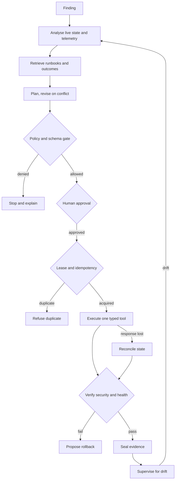
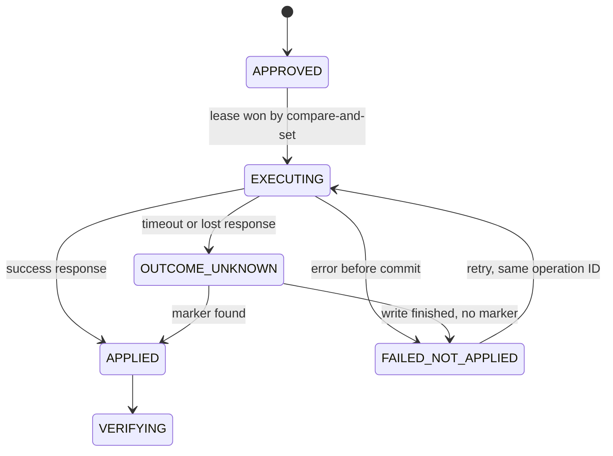

# Agentic Database Security Remediation: Competitive Analysis and PRD

2026-09-18 · @Someone

## Summary

The market detects database findings well and remediates them poorly; the opening is a scanner-neutral product that fixes findings inside the database engine and proves the result.

- **Where competitors stand.** Database-security platforms such as IBM Guardium and Thales Imperva have deep checks but stop at recommendations and tickets. Wiz now has the most complete agentic loop, with Remediation and Response in public preview since 17 August 2026, but it acts at the cloud layer and verifies from its own next scan. Cloud-native runbooks and SOAR agents can execute, without database safety logic.
- **The gap.** No reviewed vendor documents engine-internal agentic remediation, dependency-aware impact analysis, or independent verification of application health after a change. This is inference from public materials.
- **The bet.** Build the governed remediation layer. Four agents reason and make bounded decisions with separate tools and permissions. Deterministic controls enforce policy, validate parameters, manage approvals and guard execution. A named human approves every change.
- **MVP.** A self-contained five-minute demo of one PostgreSQL excessive-privilege finding through the whole lifecycle: analysis, runbook retrieval, approval, remediation, verification, evidence and drift detection. Database, finding, runbooks, historical outcomes and application simulator ship in the bundle. The reviewer opens a browser URL on Google Cloud and supplies nothing. Live agents are the default, with a labelled deterministic mode for CI and outages.
- **The moment that sells it.** A historical failed remediation reveals a month-end dependency that recent telemetry missed, and the agent revises its plan in the open before anyone approves an unsafe change.
- **Engineering depth on show.** An exactly-once mutation effect for the transactional tool under concurrent requests, reconciliation of an OUTCOME\_UNKNOWN state after a lost response, drift detection after closure, and a 5,000-finding burst with bounded concurrency and flat memory.
- **Main threat.** Wiz and Google Cloud extending Response Actions into database engines within 12 to 18 months. The counter is depth, neutrality and evidence.

Part 1 is the competitive analysis. Part 2 is the PRD. Sources and confidence levels close the doc.

# Part 1: Competitive analysis

## Market landscape

Four categories touch database findings today, and each stops short of safe, verified change inside the database.

| Category | Representative vendors | How they treat a database finding | Where they stop |
| --- | --- | --- | --- |
| Database-security platforms | [IBM Guardium](https://www.ibm.com/products/guardium-vulnerability-assessment), [Thales Imperva DSF](https://www.imperva.com/products/data-security/data-activity-monitoring/), [LevelBlue DbProtect](https://www.levelblue.com/services/data-security) | Deep engine-level scanning against CIS, STIG and CVE content, rights review, activity monitoring | Reports, recommendations and tickets. The DBA performs and proves the fix. |
| DSPM and CNAPP | [Wiz](https://www.wiz.io/blog/wiz-remediation-playbook), [Cyera](https://www.cyera.com/), [Varonis](https://www.varonis.com/blog/varonis-to-acquire-cyral-database-activity-monitoring), [BigID](https://bigid.com/blog/agentic-remediation-guide/) | Graph or data context, attack paths, sensitivity, ownership, guided or one-click fixes | Actions work at the cloud control plane, identity and sharing layer. Engine internals are shallow. |
| Cloud-native tools | [AWS Security Hub with ASR](https://aws.amazon.com/about-aws/whats-new/2026/08/automated-security-response-adds-AI-toolkit/), [Microsoft Defender for Cloud](https://learn.microsoft.com/en-us/azure/defender-for-cloud/release-notes) | Control checks per resource, remediation scripts or SSM runbooks | Single cloud, per-control scripts, little application or business context |
| Security orchestration | [Torq](https://torq.io/ai-agents-for-the-soc/), Tines, [Palo Alto Cortex AgentiX](https://jonathansblog.co.uk/cortex-xsiam-and-agentix-the-incumbents-answer-to-the-ai-soc) | General agents and workflows with approvals across many tools | SOC alert triage is the centre of gravity. Database knowledge must be built by the customer. |

Three shifts define 2026. Agentic remediation moved from guidance to execution: Wiz put Remediation and Response into public preview and made Workflows generally available on 17 August 2026. AWS added an AI toolkit for authoring custom remediations to ASR on 31 August 2026. Legacy database-security vendors pointed their AI investment at securing AI data flows, not at fixing database findings, as shown by [IBM Guardium Exposure Manager](https://www.ibm.com/new/announcements/manage-ai-data-risk-with-ibm-guardium-exposure-manager) and the [Thales AI Security Fabric](https://www.imperva.com/company/press_releases/thales-launches-ai-security-fabric-providing-ai-runtime-security-for-agentic-ai-and-llm-powered-applications/).

A search for a vendor dedicated to agentic, engine-level database remediation found none. That is an absence of evidence from public sources, not proof that no stealth entrant exists.

## Capability comparison

No vendor reviewed is rated Strong on both database depth and verified remediation; the two strengths sit in different categories.

Ratings are this analysis's judgement from public materials, not vendor claims. Strong = documented and central to the product. Partial = documented but narrow or adjacent. Limited = minimal or do-it-yourself. None found = no public evidence.

| Vendor | Analysis | Prioritization | Remediation | Agentic intelligence | Verification | Supervision and drift | Database depth |
| --- | --- | --- | --- | --- | --- | --- | --- |
| IBM Guardium VA | Strong: 2,000+ tests, CIS, STIG, CVE | Partial: weighted metrics | Limited: recommendations, ServiceNow ticketing | None found for remediation | Partial: on-demand rescan | Partial: scheduled assessments | Strong |
| Thales Imperva DSF | Strong: 1,500+ tests | Partial: CVSS plus Data Risk Intelligence scoring | Limited: virtual patching, rights review workflow, playbooks | None found for remediation | Partial: rescan | Strong for activity, partial for configuration | Strong |
| LevelBlue DbProtect | Strong | Partial | Limited: active response such as session kill or user disable | None found | Partial: rescan | Partial | Strong |
| Varonis | Partial for databases | Strong on data sensitivity and access | Partial: automated exposure and access fixes | Partial | Partial | Strong for activity through Next-Gen DAM | Partial and growing |
| Cyera | Partial | Strong on data context | Partial: native actions, Tines and Torq hand-off, previews and blast-radius insight | Partial | Partial | Partial | Limited |
| Wiz | Strong for cloud graph | Strong: attack paths, Red Agent validation | Strong at cloud layer: Response Actions, pull requests, approvals | Strong: Green Agent with verdict and confidence | Partial: confirms from next scan | Partial: continuous scanning, MTTR tracking | Limited |
| Microsoft Defender for Cloud | Partial: SQL VA rules | Partial: risk-based recommendations | Partial: per-rule remediation script, baselines | Limited for databases | Partial: rescan against baseline | Partial: baseline deviation | Partial, SQL Server centred |
| AWS Security Hub with ASR | Partial: control checks | Partial: exposure findings | Partial: 100+ control runbooks, scoped automation | Limited: AI toolkit authors runbooks; MCP app is read-only | Limited | Partial: Config re-evaluation | Limited: RDS control plane only |
| Torq, Tines, Cortex AgentiX | Limited without custom build | Limited | Strong as a generic execution and approval engine | Strong for SOC triage | Limited: customer-built | Limited | None found |
| Tamnoon | Partial: enriches CNAPP findings | Partial | Strong for cloud misconfigurations, human-assisted | Partial | Partial | Partial | Limited |

Two cells matter most. No reviewed vendor documents verification of application health after a database change. No reviewed vendor documents agentic remediation of engine-internal settings such as roles, grants, authentication rules or parameters. Both are inferences from the absence of public documentation.

## Vendor profiles

Wiz is the closest competitor in workflow shape, and the legacy database vendors are the closest in subject matter; neither combines the two.

| Vendor | Confirmed from vendor or primary sources | Inference |
| --- | --- | --- |
| [IBM Guardium Vulnerability Assessment](https://www.ibm.com/products/guardium-vulnerability-assessment) | Scans on-premises and cloud databases. More than 2,000 predefined and custom tests across CIS, STIG and CVE. Recommends remedial actions. ServiceNow integration for ticketing and on-demand rescans. Runs with minimal read-only privileges. | A natural findings source for us, not a rival in v1. IBM's 2026 launches centre on AI data exposure, so agentic remediation of database findings looks unprioritised. |
| [Thales Imperva Data Security Fabric](https://www.imperva.com/products/data-security/data-activity-monitoring/) | More than 1,500 predefined tests based on CIS and DISA STIG. CVSS-based risk scores. User rights management with review and approval. Virtual patching. Automated workflows and playbooks. | Virtual patching is a compensating control, not a configuration fix. Thales's announced AI roadmap targets AI runtime security. |
| [LevelBlue DbProtect and AppDetectivePRO](https://www.levelblue.com/services/data-security) | Database discovery, vulnerability and configuration assessment, rights review, activity alerts. Active responses such as terminating a session or disabling a user. Trustwave is now part of LevelBlue. | Ownership by a managed-services firm suggests a services-led path rather than product-led agentic investment. |
| [Varonis](https://www.varonis.com/blog/varonis-to-acquire-cyral-database-activity-monitoring) | Acquired Cyral on 17 March 2025. Sells Next-Gen Database Activity Monitoring with agentless interception, identity federation and fine-grained policy. Platform includes automated remediation of data exposure. | Strongest candidate among data-security vendors to extend automated remediation into database configuration. |
| [Cyera](https://www.cyera.com/) | Rules trigger native actions or Tines and Torq workflows. Guardrails include previews, blast-radius insight and audit trails. Generates auditor-ready evidence. Sold through AWS Security Hub Extended since February 2026. | Remediation targets data access and sharing. Engine-level hardening is outside its current focus. |
| [Wiz](https://www.wiz.io/blog/wiz-remediation-playbook), part of Google Cloud | Green Agent investigates root cause, finds the owner, and returns a Remediate or Ignore verdict with a confidence score. Remediation and Response, in public preview, offers pre-built and custom Response Actions that are revertible, versioned and least-privilege. Workflows, generally available, routes Slack approvals and confirms resolution from the next scan. Three autonomy modes: human-led, human-in-the-loop, AI-led. | Verification relies on the same scanner that raised the issue. Actions work on cloud resources, IAM and code. Custom Response Actions could be pointed at databases by a determined customer. |
| [Microsoft Defender for Cloud](https://learn.microsoft.com/en-us/azure/defender-for-cloud/release-notes) | SQL vulnerability assessment gives per-rule findings, a remediation script and baseline management. Defender for Open-Source Relational Databases is generally available for AWS RDS, billed from 1 June 2026. The Security Copilot [Vulnerability Remediation Agent](https://learn.microsoft.com/en-us/intune/copilot/agents/vulnerability-remediation-agent) covers Intune-managed Windows devices. | Microsoft has the agent framework and the SQL rules. A database remediation agent is a plausible extension, SQL Server first. |
| [AWS Security Hub and ASR](https://aws.amazon.com/about-aws/whats-new/2026/08/automated-security-response-adds-AI-toolkit/) | ASR v4.0.0 manages 100+ control remediations as SSM automation, scoped by account, OU, region and tag. Adds an AI toolkit for authoring custom remediations, deadline enforcement and MTTR metrics. The [Security Hub MCP App](https://aws.amazon.com/about-aws/whats-new/2026/07/aws-security-hub-mcp-app/) preview is read-only. | RDS coverage is control-plane only: encryption, public access, backups. Nothing inside the engine. |
| [Torq](https://torq.io/ai-agents-for-the-soc/), Tines, [Cortex AgentiX](https://jonathansblog.co.uk/cortex-xsiam-and-agentix-the-incumbents-answer-to-the-ai-soc) | Torq runs a multi-agent system for investigation, planning, remediation and case management. AgentiX ships prebuilt agents, 1,000+ integrations, MCP support and human approval for impactful actions, per third-party coverage. | These are potential execution partners as much as rivals. Database safety logic would still need to be built by someone. |
| [Tamnoon](https://tamnoon.io/blog/remediate-wiz-findings-with-tamnoon/) | Remediation layer for Wiz findings. Its own research reports critical cloud misconfigurations open for 128 days on average and under 1% of alerts ending in a confirmed fix. | Proves buyers pay for remediation as a separate layer above a CNAPP. Figures are vendor research. |

Oracle Data Safe and Google Security Command Center were not re-verified in this round and are left out of the ratings.

## Market gaps and differentiation opportunities

The open space is the last mile: changing a production database safely and proving both that the risk is gone and that nothing broke.

| Gap in the market | Evidence | Differentiation opportunity |
| --- | --- | --- |
| Engine-internal remediation | Database vendors recommend and ticket. CNAPP actions target cloud resources, IAM and code. | Typed tools for roles, grants, authentication rules, TLS and audit parameters, each with pre-checks and rollback |
| Dependency-aware impact analysis | No reviewed vendor documents checking which applications and accounts rely on a setting before changing it | Use connection logs, activity statistics and role membership to predict breakage before approval |
| Dual, independent verification | Wiz confirms from its next scan. Database vendors rescan. None document application-health checks. | A separate verifier with its own credentials checks the control state and application health signals |
| Deterministic guardrails around the agent | Vendors describe approvals and least privilege. Public detail on policy engines outside the model is thin. | Policy-as-code decides what may run. The model proposes; it never authorises. |
| Recurrence and root cause | Drift appears as a fresh finding in most tools | Link reopened findings to the prior fix and the change that undid it, such as a Terraform apply or parameter-group swap |
| Audit evidence as a product | Cyera and Guardium produce compliance evidence for data and scans. Evidence for the change itself is left to ticket systems. | Signed, per-finding evidence pack: before state, reasoning, approval, execution log, after state, health result |
| Institutional memory | Wiz cites historical remediation patterns. Others do not describe retrieval of runbooks or outcomes. | Retrieve the customer's own runbooks and past outcomes, including failures, and show them in the recommendation |

The defensible position is scanner-neutral. Customers keep Guardium, Imperva, Wiz or Security Hub for detection. The product becomes the governed remediation layer all of them feed.

## Competitive risks and likely responses

The biggest threat is Wiz extending Response Actions into database engines; the realistic window before a credible response is 12 to 18 months. All rows are inference.

| Competitor | Likely response | Likelihood | Our counter |
| --- | --- | --- | --- |
| Wiz and Google Cloud | Ship database Response Actions, starting with Cloud SQL and AlloyDB, then RDS. Market closed-loop remediation as already covering databases. | High | Depth the platform will not prioritise: dependency analysis, application-health verification, engine-specific rollback. Ingest Wiz issues so we complement rather than collide. |
| Microsoft | Add a database remediation agent to Security Copilot, anchored on SQL vulnerability assessment | Medium | Lead on PostgreSQL and multi-cloud. Treat Defender findings as a source. |
| AWS | Add RDS engine-level runbooks to ASR, or a database skill for AWS Security Agent | Medium | Cross-cloud neutrality, richer context, and independent verification that a cloud provider's own runbook lacks |
| Varonis and Cyera | Extend automated remediation from data access into database configuration | Medium | Partner on sensitivity labels. Stay ahead on verification and evidence. |
| IBM, Thales, LevelBlue | Add generative recommendations and deeper ITSM hand-off. Possible acquisition of an agentic start-up. | Medium for recommendations, low for execution | Integrate as the remediation layer for their findings. Also a plausible exit route. |
| Torq, Tines, AgentiX | Publish database remediation templates or agents | Medium | Offer our tools as actions callable from their workflows. Templates lack safety logic. |

Market risks beyond competitors:

- **Trust.** One agent-caused production outage, ours or a rival's, could set the category back. Safety evidence must be a sales asset from day one.
- **Buyer friction.** DBAs hold veto power over any tool that writes to production databases. The product must be sold with them, not around them.
- **Platform pull.** Buyers consolidating on a CNAPP may accept good-enough remediation from the platform they already own.
- **Dependency on sources.** Scanner vendors can change APIs or licensing. Support at least three independent finding sources by general availability.

# Part 2: Product requirements

## Problem statement and product vision

Database findings are easy to detect and hard to close, because the fix can break production and nobody can prove it will not.

**Problem**

- Scanners produce thousands of database findings with severity scores that ignore which application, owner and data sit behind each instance.
- The fix lands on a DBA who must work out what depends on the setting, write the change, schedule it, run it and prove it. Most findings wait.
- Security teams cannot execute fixes themselves. They lack database privileges and cannot judge application impact.
- Closure is declared when a ticket closes, not when a control is verified. Configuration drift quietly reopens the hole.
- Audit evidence is rebuilt by hand from tickets, chat threads and screenshots.
- General AI agents with database credentials are unacceptable to DBAs and auditors. Free-form SQL from a model is not a control.

**Vision**

Every database finding gets a clear answer: fix it, accept it, or defer it, with evidence. When the answer is fix, a governed agent prepares the change, a named human approves it, a narrow tool executes it, and an independent verifier proves the risk is gone and the application is healthy. The system then watches that it stays fixed.

**Product principle**

The model reasons and proposes. Deterministic policy authorises. Typed tools execute. A separate verifier judges. Humans approve anything that changes production.

## Positioning and differentiation

The product is the governed remediation layer for database findings: scanner-neutral, engine-deep, and verified.

**Positioning statement.** For security and database teams with a backlog of database findings, the product turns findings from existing scanners into approved, verified and evidenced fixes. Unlike scanners, it closes findings. Unlike CNAPP remediation, it works inside the database engine and proves the application still runs.

| Against | Their strength | Our difference |
| --- | --- | --- |
| Database-security platforms | Detection depth and compliance content | We execute and verify the fix. We ingest their findings. |
| CNAPP and DSPM remediation | Context graph, ownership, cloud-layer actions | Engine-internal tools, dependency analysis, application-health verification |
| Cloud-native runbooks | Native, cheap, one cloud | Cross-cloud, context-aware ranking, independent verifier, evidence pack |
| SOAR and agent platforms | Flexible workflows and approvals | Pre-built database safety logic. They can call our tools. |
| In-house scripts | Tailored, trusted by DBAs | Same narrow scripts, plus policy, approval, verification, drift watch and audit trail |

**Three claims the product must be able to prove**

1. No change reaches a database except through an allowlisted tool that a policy engine authorised and a human approved.
2. No finding is marked closed until a separate verifier confirms the control state and application health.
3. Every closed finding has a complete, tamper-evident evidence pack.

## Target users and jobs to be done

The security engineer buys and the DBA approves; the product must serve both or it will not be deployed.

Target customer: regulated mid-to-large enterprises with 200+ database instances, an existing scanner or CNAPP, and a central database or platform team. Financial services, healthcare and SaaS are the first segments.

| User | Role in the workflow | Job to be done | Success looks like |
| --- | --- | --- | --- |
| Database security engineer (primary buyer-user) | Triage, recommend, track | Turn a scanner backlog into a short, ranked, defensible worklist and get it closed | Fewer open criticals, shorter time to verified closure |
| DBA or database reliability engineer (approver and veto holder) | Review, approve, own the change | Fix what security asks without breaking the application or my weekend | Clear impact analysis, tested rollback, no surprises |
| Application or service owner | Consulted, sometimes approver | Know what will change on my database, when, and how I will know it worked | Notified in advance, health checks I recognise |
| GRC or audit analyst | Consumer of evidence | Show an auditor that a control failure was fixed, by whom, and that it stayed fixed | Evidence pack per finding, no screenshot hunting |
| CISO or head of infrastructure (economic buyer) | Sponsor | Reduce database risk with the team I have, without an agent-caused outage | Trend lines on risk and MTTR, zero agent-caused incidents |
| Platform or SRE team | Integrator | Deploy and bound the system inside our network, identity and change process | Least-privilege setup, IaC deployment, clear blast radius |

## Goals and non-goals

The product wins by closing database findings safely and provably, not by finding more of them.

**Goals**

1. Take a scanner finding from ingestion to verified, evidenced closure in one governed workflow.
2. Rank findings by real exposure, using database, application, ownership and business context.
3. Make every recommendation explainable: evidence, reasoning, blast radius, rollback and confidence are visible before approval.
4. Execute changes only through narrow, allowlisted, typed tools, gated by deterministic policy and human approval.
5. Verify two outcomes independently of the executor: the finding is closed, and the application is still healthy.
6. Detect drift and recurrence after closure, and reopen with the full history attached.
7. Produce an audit-ready evidence pack for every finding without extra analyst work.

**Non-goals for the first release**

- Replacing scanners, DSPM, CNAPP or database activity monitoring. The product consumes their findings.
- Covering every database engine. The MVP demo targets one bundled PostgreSQL instance and one finding.
- Fully autonomous remediation in production. Every change needs a named human approver in v1.
- Free-form SQL or shell generation executed against databases. The agent selects and parameterises pre-built tools only.
- Data discovery, classification or masking. Sensitivity labels are imported from existing tools.
- General SOAR use cases outside database findings (phishing, endpoint, identity incidents).
- Patching and major-version upgrades. They need maintenance windows and are deferred to a later phase.

## Core use cases

The demo shows five of six use cases on one finding; only exception management waits for the roadmap.

| # | Use case | Trigger | Outcome | In the demo |
| --- | --- | --- | --- | --- |
| UC1 | Triage at volume | Findings arrive in bulk | Deduplicated, ranked worklist that stays short and responsive | Yes, as the simulated 5,000-finding burst. Live scanners are roadmap. |
| UC2 | Investigated, retrieval-backed recommendation | Engineer opens the finding | Plan with live evidence, matching runbook, historical outcomes, retained grants, rollback, confidence and stated unknowns | Yes. The plan is revised when a past failure reveals a hidden dependency. |
| UC3 | Approved remediation | DBA approves a plan | Policy check, then one transactional change through one allowlisted tool, with an exactly-once mutation effect | Yes, under concurrent requests and a lost response |
| UC4 | Independent verification and closure | Execution completes | Verifier confirms the privilege is gone and the application is healthy. Evidence sealed and exported. | Yes, with deterministic checks and JSON export |
| UC5 | Drift and recurrence supervision | A closed control changes out of band | Finding reopened with history, grantor and link to the original | Yes |
| UC6 | Risk acceptance and exception management | Owner declines a fix | Time-boxed exception with rationale and review date | Roadmap |

The worked example: `orders_app` holds owner rights on orders-db. Telemetry suggests seven privileges are enough. A rolled-back fix on billing-db shows the month-end close also needs `INSERT` on `ledger_archive` and `EXECUTE` on `close_period()`. The agent confirms both objects exist here and revises the plan. The DBA approves, the change lands once, and the verifier proves that owner rights are gone and month-end close still works.

## Prioritized functional requirements

Demo-critical requirements make one finding travel the whole lifecycle inside the bundle; every live integration is roadmap.

D0 = required for the demo. D1 = demo stretch. R = production roadmap.

| ID | Area | Requirement | Priority |
| --- | --- | --- | --- |
| FR-1 | Bundle | A reviewer runs the whole demo from a browser URL and supplies no account, key, data or documents. One command starts the same stack locally. | D0 |
| FR-2 | Finding | Present the seeded excessive-privilege finding with owner, application, sensitivity and criticality from the asset manifest | D0 |
| FR-3 | Ingest | Stream simulated findings through a bounded queue and fixed worker pool. Normalise, deduplicate by asset and control, rank deterministically. | D0 |
| FR-4 | Ingest | Treat all finding text, object names, runbooks and outcomes as untrusted data, never as instructions | D0 |
| FR-5 | Analyse | Analysis agent reads role graph, grants, catalog objects and query telemetry through read-only tools and derives the privileges actually used | D0 |
| FR-6 | Retrieve | Retrieve runbooks and historical outcomes for every plan, with metadata filters. Show why each matched, its date and its outcome. Say so when nothing relevant is found. | D0 |
| FR-7 | Retrieve | When retrieved evidence conflicts with telemetry, corroborate against live state, record what is unknown, and publish a new plan version with a diff | D0 |
| FR-8 | Plan | Plan contains tool, typed parameters, grants to retain, rollback, health scenarios to run, confidence, and a fix, accept or defer decision | D0 |
| FR-9 | Agents | Four agents with separate tool allowlists, database identities and step, time and token budgets | D0 |
| FR-10 | Controls | Tool broker, schema and catalog parameter validation, and a deny-by-default policy engine sit outside the models | D0 |
| FR-11 | Approve | In-app approval by persona. Bound to the plan hash, separation of duties enforced, approval expires. | D0 |
| FR-12 | Execute | One transactional write tool applies the change and an idempotency marker together. No tool accepts free-form SQL. | D0 |
| FR-13 | Execute | Lease per target and compare-and-set state transitions guarantee an exactly-once mutation effect for the transactional tool under concurrent requests | D0 |
| FR-14 | Recover | A failure before commit returns an explicit error and sets FAILED\_NOT\_APPLIED. A lost response sets OUTCOME\_UNKNOWN, and the remediation agent reconciles through the status tool before any retry. | D0 |
| FR-15 | Verify | Verifier agent runs deterministic security assertions and a negative probe under its own identity | D0 |
| FR-16 | Verify | Verifier runs the simulator's scripted health scenarios, including every scenario the plan names, and compares with baseline | D0 |
| FR-17 | Roll back | Failed verification produces a rollback proposal that runs through the same gates | D0 |
| FR-18 | Supervise | Supervisor detects out-of-band drift within 10 seconds, names the grantor, and reopens the finding linked to the original | D0 |
| FR-19 | Evidence | Append-only activity timeline and one-click JSON evidence export | D0 |
| FR-20 | Learn | Write the closed remediation's outcome back to the corpus so it is retrievable next time | D0 |
| FR-21 | UI | Single-screen workbench: finding and plan, lifecycle rail, timeline, decision cards, plan diffs, invariant counters | D0 |
| FR-22 | Demo control | Guided and explore modes, chaos panel with four switches, reset to seed state in under five seconds | D0 |
| FR-23 | Observability | Live gauges for queue depth, in-flight work, throughput and orchestrator memory | D0 |
| FR-24 | Test | Each systems scenario runs headless in CI and asserts its invariant | D0 |
| FR-25 | Demo | Counterfactual replay of Plan v1 on a scratch copy | D1 |
| FR-26 | Demo | Deterministic mode for CI and outages: model decisions replayed or stubbed, everything else live, clearly labelled | D0 |
| FR-27 | Integrate | Live scanner and cloud finding connectors with an OCSF-based schema | R |
| FR-28 | Integrate | Slack or Teams approvals, ITSM change records, SSO and SCIM | R |
| FR-29 | Integrate | CMDB, service catalogue and DSPM context. Observability-based health signals. | R |
| FR-30 | Risk | Context-weighted risk scoring across a real fleet, with visible factors | R |
| FR-31 | Evidence | Hash-chained log with external anchoring, long-term retention, PDF reports, compliance-framework mapping | R |
| FR-32 | Breadth | More findings, RDS and Aurora targets, other engines, campaign mode, exception workflow, infrastructure-as-code pull requests | R |
| FR-33 | Credentials | Just-in-time, per-action credentials from the customer's secrets manager or cloud IAM | R |

**Added for the hosted, live-agent demo**

| ID | Area | Requirement | Priority |
| --- | --- | --- | --- |
| FR-34 | Live agents | Live Agent Mode is the default. All four agents call the model from the Cloud Run backend with a key held in Secret Manager. | D0 |
| FR-35 | Hosting | Per-session isolation of databases and roles, session state kept in the database, expiry and cleanup | D0 |
| FR-36 | Guards | Plan-completeness check and verdict guard, enforced outside the models | D0 |
| FR-37 | Latency | Streamed agent output, prompt caching, batched reads, per-turn timeout with single-step fallback, adaptive pacing in guided mode | D0 |
| FR-38 | Spend and abuse | Signed invite links, rate limits, token budgets per session and per day, a cap on concurrent sessions | D0 |
| FR-39 | Seeded stores | Telemetry, job history and role-change audit history are explicit seeded tables in a platform database. Every piece of evidence carries a source label. | D0 |
| FR-40 | Replay hygiene | Recordings are captured from live runs and invalidated in CI when prompts, tools or seed data change | D0 |

## Agentic workflow: analysis, remediation, verification, supervision

Four agents reason and decide within bounds, each with its own tools and database identity; deterministic controls decide what is allowed to happen.

Rectangles are work steps, most of them done by agents. Diamonds are deterministic gates that no agent can skip or influence.

**The agents**

| Agent | Reasons about | Bounded decisions it may make | Stage-specific allowlisted tools | Database identity |
| --- | --- | --- | --- | --- |
| Analysis | What the role can do, what the application really uses, what history says | Fix, accept or defer. Which grants to retain. Whether retrieved evidence overrides telemetry. Confidence. When to stop investigating, within a step budget. | `read_role_graph`, `read_grants`, `read_catalog_object` on the live catalog. `read_query_telemetry`, `read_job_runs` on the seeded platform tables. `search_runbooks`, `search_outcomes` on the corpus. | `agent_analysis`: catalog and telemetry read only. No table data. |
| Remediation | Whether the world still matches the plan, and what happened when the outcome is unclear | Proceed or abort after pre-flight. Reconcile instead of retry on a lost response. Propose rollback. | `preflight_check`, `apply_right_size_role`, `get_operation_status`, `rollback_right_size_role` | `agent_remediator`: may only execute two security-definer procedures that validate their own parameters |
| Verification | Whether the risk is gone and the application is healthy | Pass, fail or inconclusive. Extend the soak once when inconclusive. It must run every health scenario the plan names. | `assert_privileges`, `run_negative_probe`, `run_health_scenarios`, `read_health_baseline` | `agent_verifier`: read only, plus the probe credential. Cannot see the remediation agent's report. |
| Supervision | Whether a change after closure is drift or authorised, and whether it is part of a pattern | Reopen or annotate. Link to the original. Flag recurrence. | `read_control_fingerprint`, `read_membership_grantor`, `search_outcomes`, `reopen_finding` | `agent_supervisor`: catalog read only |

**The deterministic controls**

| Control | What it enforces | Why it is not left to a model |
| --- | --- | --- |
| Tool broker | Per-agent tool allowlist, credential injection at call time, call logging | An agent cannot call what it was never given |
| Parameter validation | JSON schema for every tool, then catalog checks: the role exists, is not a protected role, every granted object exists | Malformed or hallucinated parameters stop here |
| Policy engine | Rules in a versioned file: allowed tools per environment, protected roles, maximum grants per plan, approval required | Deny by default, the same answer every time |
| Plan-completeness check | A plan must incorporate or explicitly dismiss every retrieved failed outcome of the same finding type | A live model may overlook evidence. The gate may not. |
| Approval service | Plan-hash binding, separation of duties, expiry | Any plan change voids the approval |
| Execution guard | Lease per target, idempotency marker committed with the change, operation state machine, reconcile before retry | An exactly-once mutation effect for the transactional tool, under races and lost responses |
| Verdict guard | The verifier agent cannot pass a change when any assertion failed | Closure rests on checks, not on a model's summary of them |
| Budgets | Step, time and token limits per agent run, per session and per day | Bounded cost, bounded latency, no runaway loops |

**Retrieval is central, and it is evidence rather than truth.** The analysis agent retrieves runbooks and historical outcomes for every plan, filtered by engine, finding type, application family and role pattern. When a retrieved outcome conflicts with telemetry, the agent must do three things: corroborate it against live state, state what remains unknown, and show the plan change as a diff. In the demo, a rolled-back fix on billing-db reveals the month-end job that 14 days of telemetry never saw. The agent confirms `close_period()` and `ledger_archive` exist in orders-db, keeps two grants, and adds the month-end scenario to verification. After closure, the supervisor writes this remediation's outcome back to the corpus, so the next plan starts smarter.

## Human-approval and autonomy model

Autonomy is granted per tool, per environment, by policy and by track record; the MVP ships with production changes always approved by a human.

The demo runs at L2 only: one in-app approval by the DBA persona, with separation of duties and plan-hash binding enforced. Within each stage the agents still make bounded decisions of their own, such as revising a plan, aborting after pre-flight, reconciling instead of retrying, or reopening on drift. None of those decisions can change a database without passing the gates. The table below is the production model.

| Level | Name | What the system may do alone | Human role | MVP availability |
| --- | --- | --- | --- | --- |
| L0 | Observe | Ingest, enrich, score, investigate read-only | Reads results | Default for everything |
| L1 | Recommend | Draft plan and route it | Executes manually from the plan | Yes |
| L2 | Approve to execute | Execute after a named approval per action | Approves each plan | Yes. The ceiling for production. |
| L3 | Pre-approved class | Execute a pre-approved tool and parameter class within a window, notify after | Approves the class once, reviews reports | Non-production only, off by default |
| L4 | Autonomous within policy | Execute and verify, with auto-rollback, no prior notice | Audits | Not in MVP |

Rules that hold at every level:

- **Separation of duties.** The person who requests or edits a plan cannot approve it. High-criticality assets need two approvers, one from the owning team.
- **Approval binds to a plan hash.** Any change to tool, parameters, target or window voids the approval.
- **Approvals expire.** Default 72 hours, or the end of the change window.
- **Autonomy is earned.** A tool class can move from L2 to L3 only after 25 consecutive verified successes on that engine and environment tier, and only by an administrator's policy change.
- **Autonomy is revoked automatically.** One failed verification or rollback in a class returns it to L2 pending review.
- **Kill switch.** One control halts all execution fleet-wide. Read-only supervision continues.
- **Break-glass is human.** Emergency changes outside policy are made by people through their normal privileged access. The product records them as drift context, never performs them.

The 25-success threshold and 72-hour expiry are proposed defaults to validate with design partners.

## Security and trust requirements

The demo proves the trust architecture at small scale: separate agent identities, deterministic gates and exactly-once execution are real, while enterprise hardening waits for production.

| ID | Area | In the demo | Production roadmap |
| --- | --- | --- | --- |
| ST-1 | Least privilege | Four database roles, one per agent. Only the remediator can change anything, and only by executing two security-definer procedures. | Per-tenant identities and cloud IAM roles |
| ST-2 | Credentials | Static demo credentials held by the broker and injected at call time. Never placed in a model prompt or the timeline. | Just-in-time, per-action credentials from the customer's secrets manager |
| ST-3 | Tool surface | Typed, versioned, allowlisted tools per agent. Schema and catalog validation. No free-form SQL or shell. | Signed tools, staged upgrades, customer-authored tools under review |
| ST-4 | Deterministic policy | Deny-by-default rules in a versioned file, evaluated outside the model. Protected roles cannot be targeted. | OPA or Cedar, policy testing, change review |
| ST-5 | Approval | Plan-hash binding, separation of duties, expiry, in-app personas | SSO identities, Slack and ITSM routing, two-person approval for critical assets |
| ST-6 | Execution integrity | Lease, idempotency marker committed with the change, state-machine transitions, reconcile before retry | Same design, multi-region and multi-tenant |
| ST-7 | Prompt-injection defence | Finding text, role comments and corpus documents are handled as data. A planted-instruction test is part of CI. | Red-team programme across every channel |
| ST-8 | Data minimisation | Agents read catalog metadata and query shapes, never table contents | Redaction of literals and secrets before model calls |
| ST-9 | Explainability | Decision cards with evidence, confidence and unknowns. Retrieved sources are inspectable. | Model and prompt version recorded per decision |
| ST-10 | Audit trail | Append-only activity timeline with insert-only permissions. JSON evidence export. | Hash chaining, external anchoring, SIEM export, retention to 7 years, PDF reports |
| ST-11 | Safe failure | Execution fails closed when a gate, the broker or the verifier is unavailable. Unknown outcomes are reconciled, never assumed. Kill switch in the UI. | Blast-radius caps, ring rollout, fleet-wide halt |
| ST-12 | Bounded agents | Step, time and token budgets per run. Bounded concurrency for agent runs. | Per-tenant quotas and cost controls |
| ST-13 | Honest labelling | The UI states which model mode is running and what is simulated | Not applicable |
| ST-14 | Enterprise assurance | Out of scope | Tenant isolation, customer-managed keys, SOC 2 Type II, ISO 27001, penetration test, SBOM, in-network execution plane |

**Added for hosting on Google Cloud with live agents**

| ID | Area | In the demo | Production roadmap |
| --- | --- | --- | --- |
| ST-15 | Model key | Stored in Secret Manager, readable only by the Cloud Run service account, never sent to the browser, logged or placed in a prompt | Customer-managed keys and customer-cloud model endpoints |
| ST-16 | Data to the model provider | Synthetic data only. Reviewer input is limited to clicks, persona switches and bounded corpus edits treated as data. | Redaction, in-region inference, contractual no-training terms |
| ST-17 | Public endpoint | Signed invite token, rate limiting, caps on sessions and tokens, no free-text prompts | SSO, tenant isolation, WAF |
| ST-18 | Session isolation | Per-session databases and roles. No cross-session reads. Expiry after 60 minutes. | Tenant isolation |
| ST-19 | Mode integrity | Deterministic mode replaces model decisions only. Gates, tools and database effects are identical in both modes. The mode is recorded per decision. | Same |

## MVP scope

The MVP is a hosted, self-contained demo: a reviewer opens a browser URL and watches one PostgreSQL excessive-privilege finding travel the whole lifecycle, driven by live agents, in about five minutes.

Self-contained means the reviewer supplies nothing: no account, API key, data or documents. The hosted backend calls an external model service with a key the reviewer never sees.

**The finding.** The application role `orders_app` is a member of `orders_owner`, the role that owns the schema. The orders API can alter, drop or re-grant every object in a database that holds customer PII. The fix is to right-size the role: remove the owner membership and grant only what the application needs.

Why this finding earns the only slot:

- It lives inside the engine, where CNAPP remediation does not reach.
- The safe fix depends on knowing what the application really uses, so analysis, retrieval and health verification all matter.
- It is one transactional change with a clean inverse, which makes the exactly-once mutation effect and rollback demonstrable.
- Anyone can grasp it in one sentence: the app logs in with owner rights.

**What ships in the bundle**

| Component | What it is | Stands in for |
| --- | --- | --- |
| Target database | PostgreSQL 16 with the seeded `orders` schema, roles, and the remediation procedures and ledger | The customer's database fleet |
| Platform database | Seeded telemetry, audit history, knowledge corpus and orchestrator state, kept apart from the target | Telemetry store, audit pipeline, runbook library and ticket history |
| Seeded finding and finding generator | One real finding on the target database, plus a generator for simulated bursts | Live scanner and cloud connectors |
| Application simulator | An orders API with three scripted scenarios: place order, read order, month-end close. Fixed seed, deterministic results. | The real application and its observability |
| Asset manifest | Owner, application, data sensitivity and criticality in one YAML file | CMDB, DSPM and cloud tags |
| Approver personas | A requester and a DBA, switchable in the UI | Slack, ITSM and SSO |
| Orchestrator | Four agents, tool broker, policy engine, approval service, activity timeline, web UI | The same services, hardened |
| Chaos panel | Four switches: concurrent request, drop next response, out-of-band drift, finding burst | Real-world failure |

**Seeded data stores.** PostgreSQL does not keep 14 days of per-role query history or a history of role changes by itself. The demo makes both explicit seeded tables in the platform database, and the UI labels every piece of evidence with its source.

| Store | Location | Contents | How it is filled | Stands in for | UI source label |
| --- | --- | --- | --- | --- | --- |
| `telemetry.query_log` | Platform database | One row per statement fingerprint, role, application name and day: command, objects touched, call count | Seeded with 14 days. The simulator appends rows as scenarios run. | Aggregates shipped from `pg_stat_statements` or server logs to a telemetry store | Seeded demo telemetry |
| `telemetry.job_runs` | Platform database | Scheduled-job run history, including the last month-end close 19 days ago | Seeded | Scheduler or observability history | Seeded demo telemetry |
| `audit.role_change_log` | Platform database | Timestamp, actor, action, target role, granted role, origin | Seeded history. The remediation procedure's change is recorded by the orchestrator. The drift switch appends the out-of-band actor's row as a simulated audit feed. | A pgaudit or DDL-log pipeline | Simulated audit feed |
| `kb.runbooks`, `kb.outcomes` | Platform database | About 12 runbooks and 40 historical outcomes, including the failed billing-db remediation | Seeded. The supervisor writes back the new outcome. | Runbook library and ticket history | Knowledge corpus |
| `control.operations`, `control.timeline` | Platform database | Operation state machine and the append-only activity timeline | Written by the orchestrator only, insert-only for the timeline | Production control plane | Platform record |
| `remediation.ledger` | Target database | Idempotency marker per operation ID | Inserted by the write procedure in the same transaction as the change | The same, in production | Native to the change |
| PostgreSQL system catalogs | Target database | Roles, memberships with grantor, grants, objects | Native | The same, in production | Live catalog |

The catalog is the source of truth for detection and verification. The audit log adds who and when. If the catalog shows a change with no matching audit row, the supervisor says so rather than guessing.

**Moved to the production roadmap**

- Live scanner, cloud, Slack, ITSM, CMDB, DSPM, observability, SSO and compliance-framework integrations
- Real telemetry and audit pipelines in place of the seeded tables
- External log anchoring, long-term retention, PDF reporting and other enterprise controls
- The other candidate findings: TLS enforcement, audit logging gaps, internet exposure, SCRAM migration
- RDS, Aurora and Cloud SQL customer targets, other engines and clouds
- Autonomy above L2, campaign mode, exception workflow, infrastructure-as-code pull requests

## Deployment and model modes

The demo runs on Google Cloud behind one browser URL, with Live Agent Mode as the default and a clearly labelled deterministic mode for CI and outages.

**Hosting**

| Piece | Google Cloud service | Notes |
| --- | --- | --- |
| Orchestrator, agents, tool broker, UI | Cloud Run service | Minimum one warm instance. Streams agent output to the browser. |
| Application simulator | Second container in the same Cloud Run service | Reached over localhost |
| Target and platform databases | Cloud SQL for PostgreSQL 16 | Each reviewer session gets its own database pair and session-suffixed roles, cloned from a template. The UI shows the logical names. Sessions expire after 60 minutes. |
| Model API key | Secret Manager | Readable only by the Cloud Run service account. Never sent to the browser, never logged, never placed in a prompt. |
| Reviewer access | Unlisted URL with a signed invite token | No login. Rate limited. A cap on concurrent sessions. |
| Spend guard | In the orchestrator | Token budget per session and a global daily cap. When a cap is hit, the session continues in deterministic mode with the label shown. |
| Local development and CI | Docker Compose with the same containers plus a PostgreSQL container | Runs in deterministic mode with networking disabled |

Session state lives in the database, not in a Cloud Run instance. Cloud Run [session affinity](https://cloud.google.com/run/docs/configuring/session-affinity) is best effort and one instance can serve several clients, so an instance-local database would let reviewers collide or lose their session. Cloud SQL permissions for role creation and security-definer procedures should be confirmed in the week-one spike.

Only synthetic data reaches the model provider. Reviewer input is limited to clicks, persona switches and bounded edits to corpus documents in explore mode, and those edits are handled as data, never as instructions.

**Model modes**

| Aspect | Live Agent Mode (default) | Deterministic mode |
| --- | --- | --- |
| Used for | Every reviewer session | CI, model-provider outage, spend cap reached, or a single step that timed out |
| Model decisions | Live calls from the Cloud Run backend | Replayed from recorded live runs, keyed by step and input hash. If no recording matches, a rule-based stub decides and says so. |
| Retrieval, policy, tools, database changes, injected failures, verification, drift detection | Live | Live |
| On-screen label | "Live agents" chip | Persistent banner: "Deterministic mode: model decisions are replayed. Everything else is live." Each affected decision card carries a tag. |
| Recorded in timeline and evidence | Mode, model and prompt version per decision | Mode and replay source per decision |

Two deterministic guards make live agents safe to show. A plan-completeness check refuses any plan that ignores a retrieved failed outcome of the same finding type: the agent must incorporate it or dismiss it with a reason. A verdict guard stops the verifier agent from passing a change when any assertion failed. If a live agent reaches a different but valid plan, the gates still hold and the demo still works.

**Latency budget for Live Agent Mode**

Five minutes is a target, not a hard limit. The figures below are planning estimates to replace with measurements from 30 live runs in week one.

| Stage | Estimated model turns | Estimated model time |
| --- | --- | --- |
| Analysis and Plan v1 | 6 to 8 | 30 to 45 s |
| Retrieval, corroboration and Plan v2 | 3 to 4 | 15 to 25 s |
| Remediation: pre-flight, apply, reconcile | 3 to 4 | 12 to 20 s |
| Verification | 2 to 3 | 10 to 15 s |
| Supervision on drift | 2 to 3 | 10 to 15 s |

That totals roughly 80 to 120 seconds of model time. Tools, gates and database work add under 10 seconds. Reading, the approval and the chaos beats take about three minutes. The guided run should therefore land between four and a half and six minutes, with seven minutes as the acceptable ceiling at the 95th percentile.

How the run stays inside the budget:

- Stream every token and tool call, so waiting looks like watching the agent work.
- Cache the system prompt and tool definitions. Batch independent read tools into one turn.
- Use a faster model for the verifier and supervisor if quality holds in testing.
- Cap decision-card length. Long reasoning lives one click deeper.
- Give each model turn a 20-second timeout and one retry. After that, the single step falls back to deterministic mode with its tag, and the run continues.
- Let guided mode shorten reading pauses when model time runs long.

## Demo flow

The demo tells one story in nine beats: the agents almost make an unsafe change, historical evidence stops them, and the system then proves the safe change took effect exactly once.

| Beat | Time | What the viewer sees | What is really happening | Why it matters |
| --- | --- | --- | --- | --- |
| 1. The finding | 0:00 | One card: "The orders API can drop any table in orders-db." Owner, application and PII label beside it. | Seeded finding joined to the asset manifest | Plain language first. No wall of findings. |
| 2. Analysis | 0:30 | The analysis agent's tool calls stream into the timeline. Plan v1 appears: remove owner membership, grant the 7 privileges seen in 14 days of telemetry. | Live model calls. Read-only tools over the live catalog and the seeded telemetry tables, each result labelled with its source. | The agent shows its work. |
| 3. The retrieval moment | 1:30 | Two retrieved cards: runbook RB-07 "Right-size an application role" and outcome OUT-0212, a rolled-back fix on sibling database billing-db. The month-end close job failed nine days after the change. The agent checks that `close_period()` and `ledger_archive` exist here, then publishes Plan v2. A diff shows +2 grants and +1 health scenario, tagged "Revised because of historical evidence". | Retrieval over the bundled corpus, then a live catalog read to corroborate. The month-end job last ran 19 days ago, outside the telemetry window. | The centre of the story. Telemetry alone would have approved an unsafe fix. |
| 4. Policy and approval | 2:15 | A gate badge lists the rules that passed. The requester persona tries to approve and is refused. The DBA persona approves Plan v2. | Deterministic policy check, plan-hash binding, separation of duties | Humans and rules decide, not the model. |
| 5. Execution under stress | 2:45 | With "concurrent request" and "drop next response" armed, the timeline shows: lease acquired, duplicate request refused, OUTCOME\_UNKNOWN, reconciling, confirmed applied once. A counter reads Mutations: 1. | Lease on the target, one transactional tool call, idempotency marker committed with the change, reconciliation read | Failure handled calmly, in the open. |
| 6. Verification | 3:30 | Two panels turn green. Security: membership gone, forbidden DDL refused, only planned grants present. Health: place order, read order and month-end close all pass. | Verifier agent under its own identity, catalog assertions, a negative probe and the simulator's scripted scenarios | Closed means proven, on both axes. |
| 7. Evidence | 4:00 | The timeline seals. One click exports the JSON evidence file. | Append-only timeline serialised with plans, retrieved sources, policy result, approval, before and after state, verification | Audit-ready without extra work. |
| 8. Drift | 4:20 | The presenter flips "out-of-band drift". Within 10 seconds the finding reopens, linked to the original, naming the grantor. | Supervisor agent compares the live control fingerprint with the sealed after-state and reads the membership grantor | Fixed stays fixed, or you hear about it. |
| 9. Burst | 4:40 | 5,000 simulated findings arrive. Gauges show queue depth capped, 8 in flight, memory flat. The worklist collapses them to a short ranked list and stays responsive. | Streaming ingest, bounded queue, fixed worker pool, deterministic deduplication. Agents are not invoked per finding. | It scales without drama. |

Times are indicative for Live Agent Mode. Model latency varies, so guided mode adapts its reading pauses and the run may take between four and a half and seven minutes. The latency budget is in Deployment and model modes.

Two ways to run it. Guided mode plays the beats with captions and pauses only for the approval. Explore mode leaves every control to the presenter. A reset button restores the seed state in under five seconds.

Stretch beat, if time allows: a counterfactual replay that applies Plan v1 to a scratch copy and shows the month-end scenario failing. It makes the retrieval moment unforgettable, but cloning cluster-wide roles adds scope, so it is not in the five-minute path.

## Systems-engineering scenarios

Five scripted scenarios, four of them in the guided run, prove the system is correct under concurrency, partial failure, change and load, and each leaves a visible trace in the timeline.

**The guarantee, stated precisely.** The demo guarantees an exactly-once mutation effect for this transactional tool. It does not claim exactly-once execution in general. Requests may be delivered twice and calls may be retried. What holds is that the role change takes effect once per approved plan, because the change and its idempotency marker commit or roll back together in one PostgreSQL transaction.

**Two failures that must not be confused**

| What happened | What the caller sees | Operation state | Safe next step |
| --- | --- | --- | --- |
| The request or transaction fails before commit: validation error, lock timeout, aborted transaction | An explicit error | `FAILED_NOT_APPLIED`. PostgreSQL rolled back the change and the marker together. | Retry with the same operation ID, or send the plan back to analysis if pre-flight no longer holds |
| The response is lost after commit, or no response arrives at all | A timeout. The caller cannot tell whether the commit happened. | `OUTCOME_UNKNOWN` | Never retry blind. Reconcile first. |

Reconciliation is careful about one trap: a missing marker can also mean the write is still in flight. The write procedure holds a lock on the target role for its whole transaction and runs under a statement timeout. The status tool takes the same lock before it reads, so it only ever sees a finished transaction. It then checks the marker and compares live state with the planned after-state.

**The scenarios**

| Scenario | Injected condition | Mechanism | Invariant | What the viewer sees |
| --- | --- | --- | --- | --- |
| Concurrent remediation requests | Two execution requests for the same approved plan arrive within milliseconds | Compare-and-set transition from `APPROVED` to `EXECUTING`. A lease per target. A unique key on target plus plan hash in `control.operations`. | One mutation effect per approved plan | "Request B refused: operation op-1 holds the lease". Mutations: 1. |
| Lost execution response | The broker drops the tool response after the database commits | The operation becomes `OUTCOME_UNKNOWN`. The remediation agent decides to reconcile and calls the status tool, which finds the marker in `remediation.ledger`. | No second mutation. No silent failure. Unknown is always resolved. | `OUTCOME_UNKNOWN`, then "Reconciling", then "Confirmed applied once" |
| Failure before commit, in explore mode and CI | The procedure is made to fail after the change but before commit | PostgreSQL rolls back change and marker. The tool returns an explicit error. | State equals the before-state. A retry with the same operation ID applies once. | `FAILED_NOT_APPLIED`, then a clean retry |
| Drift after closure | An out-of-band session re-grants `orders_owner` to `orders_app` | Supervisor polls a control fingerprint from the live catalog every 5 seconds and compares it with the sealed after-state. Grantor comes from the membership catalog, time and actor from `audit.role_change_log`. | Detection within 10 seconds. The reopened finding links to the original. | Finding reopens with who, what and when, each labelled with its source |
| Finding burst | 5,000 simulated findings injected at once | Streaming parser, bounded queue of 256, fixed pool of 8 workers, back-pressure to the generator, deduplication by asset and control key. Agent analysis is capped at 2 concurrent runs and only for top-ranked findings. | Queue depth never exceeds its cap. Orchestrator memory stays under 256 MB and flat. The UI stays responsive. | Live gauges for queue depth, in-flight work, throughput and memory |

The numbers above are proposed budgets. They become regression tests: each scenario runs headless in CI in deterministic mode and fails the build if its invariant breaks.

## Experience design

The demo should feel like watching a careful colleague work: one screen, plain language, every decision explained, and failure treated as a normal state rather than an error.

**One screen, three regions**

- **Left: the finding and the plan.** The risk in one sentence, the asset context, and the current plan with its version history.
- **Centre: the lifecycle rail.** Analyse, Approve, Remediate, Verify, Supervise. Each stage shows its agent, what that agent may touch, and its current state.
- **Right: the activity timeline.** Append-only, newest at the bottom, filterable by agent, gate or tool.

**Design principles**

| Principle | How it shows up |
| --- | --- |
| Plain language first, detail on demand | Headlines a manager can read. Tool calls, SQL catalog results and JSON sit one click deeper. |
| Every agent decision is a card | Decision, why, evidence with links, confidence, and what I could not confirm |
| AI and enforcement look different | Agent cards carry the agent's name and permission chip. Deterministic gates use a distinct badge: policy, schema validation, approval, lease. A viewer can always tell what reasoned and what enforced. |
| Uncertainty is stated, not hidden | "Telemetry covers 14 days. The month-end job last ran 19 days ago, so I cannot confirm this dependency from telemetry." |
| Plan changes are diffs | Plan v1 to v2 shows added grants and the added health scenario, with the evidence that caused each |
| Failure has a designed state | "Outcome unknown" is an amber stage with a next step, not a red error page |
| Invariants are visible | Persistent counters: Mutations: 1. Duplicate requests refused: 1. Policy denials: 1. |
| Permissions are legible | Hovering an agent shows its tool allowlist and its database identity, for example "can read catalog, cannot write" |
| Retrieval is inspectable | Each retrieved document shows why it matched, its date and outcome, and how the agent weighed it against conflicting evidence |
| Calm motion | Stages advance at reading speed in guided mode. Nothing flashes. Colour is never the only signal. |

**The moment to land.** Beat 3 should make the room lean in. Plan v1 looks reasonable and the viewer is ready to approve it. Then a seven-month-old rollback record surfaces, the agent checks it against the live catalog, says what it still does not know, and changes its mind in the open. Beat 6 pays it off when the month-end scenario passes.

**Copy and tone.** Short sentences, active voice, no jargon in headlines. The agents say "I" when explaining a decision and never claim certainty they lack.

## Success metrics

The demo succeeds if viewers trust it and want the next conversation; the product later succeeds on verified closure rate.

**Demo scorecard**

| Type | Metric | Target |
| --- | --- | --- |
| Comprehension | Viewers who can explain, unprompted, why the plan changed | 4 of 5 in hallway tests |
| Trust | Viewers who say they would let this run against a non-production database of theirs | 3 of 5 DBAs interviewed |
| Pull | Demos that lead to a design-partner follow-up meeting | 5 of the first 15 |
| Reliability | Guided runs that finish with every invariant holding | 100 of 100 in CI, and every live showing |
| Speed | Guided run time in Live Agent Mode | About 5 minutes at the median, under 7 at the 95th percentile |
| Footprint | Orchestrator memory during burst, and whole-stack memory | Under 256 MB, under 1 GB |
| Correctness | Mutation effects per approved plan under races, lost responses and pre-commit failures | Exactly 1 |
| Craft | Open defects in copy, layout or motion rated noticeable at demo time | Zero |

**Product metrics for the design-partner phase.** The north star is verified closure rate. Targets below are proposals to reset once baselines are measured.

| Type | Metric | Definition | MVP target |
| --- | --- | --- | --- |
| North star | Verified closure rate | In-scope findings closed with a passed dual verification, divided by in-scope findings ingested, per quarter | 60% or more within 90 days of deployment |
| Outcome | Median time to verified remediation | Ingestion to sealed evidence pack | Under 10 days, against a partner baseline measured at onboarding |
| Outcome | Recurrence rate | Closed findings reopened by drift within 90 days | Under 5%, with cause identified for 80% of reopens |
| Safety | Agent-caused incidents | Production incidents attributed to a product-executed change | Zero |
| Safety | Rollback rate | Executions ending in rollback | Under 3% |
| Safety | Policy bypasses | Actions executed without policy allow and valid approval | Zero, proven by log audit |
| Quality | Recommendation acceptance | Plans approved without material edit | 70% or more |
| Quality | Dependency-analysis precision | Changes where a predicted-safe verdict was followed by a health regression | Under 2% |
| Quality | Verifier disagreement | Cases where the verifier fails a change the executor reported as successful | Tracked, every case reviewed |
| Efficiency | Engineer time per finding | Hands-on minutes from open to closure | 50% lower than partner baseline |
| Trust | DBA approval latency | Median time from plan routed to decision | Under 24 hours |
| Evidence | Audit readiness | Closed findings with a complete evidence pack | 100% |
| Business | Design-partner conversion | Design partners converting to paid | 3 of 5 |

## Risks and mitigations

The risk that matters most is a product-executed change causing a production outage; every design choice above exists to make that unlikely and recoverable.

**Demo risks.** For the demo the main risk is different: looking staged. Every mitigation below keeps the demo honest.

| Risk | Likelihood | Impact | Mitigation |
| --- | --- | --- | --- |
| The demo looks scripted, so viewers discount the agents | Medium | High | Live Agent Mode is the default. Tools, database, policy, faults and verification are live in both modes. Explore mode lets viewers change the scenario. A test proves Plan v1 really fails month-end. |
| A live agent does not revise the plan during a showing | Medium | High | Measure the rate across 50 runs. The plan-completeness check refuses a plan that ignores the failed outcome, and the agent gets one guided retry. The gate firing is itself a good story. |
| Live model latency stretches the run | High | Medium | Streaming, prompt caching, batched reads, a faster model where quality holds, per-turn timeout with single-step fallback, adaptive pacing, a seven-minute ceiling |
| Model-provider outage or rate limit during a review | Medium | High | Automatic, labelled deterministic mode. Recordings kept fresh by CI. |
| The hosted key is abused or spend runs away | Medium | Medium | Signed invite links, rate limits, per-session and daily token caps, a cap on concurrent sessions, no free-text prompts from reviewers |
| Reviewer sessions interfere with each other | Medium | High | Per-session databases and roles, session state in the database, expiry and cleanup |
| Deterministic mode is mistaken for fake AI | Low | Medium | Persistent banner, per-card tags, mode recorded in the evidence export |
| Seeded telemetry is mistaken for a native PostgreSQL feature | Medium | Medium | Explicit tables in a separate platform database and a source label on every piece of evidence |
| The retrieval moment feels contrived | Medium | High | A periodic job outside the telemetry window is a pattern DBAs recognise. The corpus includes distractors and one outcome that supports Plan v1, so the agent must weigh evidence. |
| Chaos features overwhelm the story | Medium | Medium | Guided mode arms the switches itself and captions each in one line. Depth lives in explore mode. |
| Demo shortcuts leak into the product architecture | Medium | Medium | Seeded stores and personas sit behind the interfaces their live replacements will use |

**Product risks**

| Risk | Likelihood | Impact | Mitigation |
| --- | --- | --- | --- |
| A remediation breaks an application | Medium | Severe | Dependency analysis, pre-checks, change windows, soak period, tested rollback, ring rollout, L2 ceiling in production |
| Model error or hallucinated evidence | Medium | High | Claims must cite collected evidence. Policy engine and typed tools bound what any error can do. Verifier is independent. |
| Prompt injection through findings, object names, runbooks or tickets | Medium | High | Untrusted-data handling, no instruction-following from data channels, tool and target fixed by policy, red-team suite per channel |
| Compromise of the product becomes a path to databases | Low | Severe | No standing credentials, in-network execution plane, per-action scoping, signed tools, kill switch, external log anchoring |
| Incomplete dependency data gives false confidence | High | High | State observation window and coverage in every plan. Lower confidence when logs are short. Require a longer window for high-criticality assets. |
| DBAs reject the tool | Medium | High | DBAs as design partners, tools written as reviewable code, start with F3, show every command before approval |
| Health signals are missing or noisy | High | Medium | Minimum built-in checks from database metrics. Make observability integration a deployment prerequisite for production execution. |
| Managed-service behaviour differs by version, for example a parameter needing a restart | Medium | Medium | Version-aware tool pre-checks, test matrix per engine version, restart-required actions forced into windows |
| Platform vendors ship good-enough database remediation | High | High | Stay scanner-neutral, lead on verification and evidence, expose tools to their workflows, move to the second engine quickly after MVP |
| Finding-source API or licence changes | Medium | Medium | Three or more sources by general availability, OCSF-based schema, file import fallback |
| Regulatory or audit objections to AI in change management | Medium | Medium | Human approval, deterministic policy, full trace, mapping to existing change-control frameworks, customer-hosted model option |
| Scope creep into scanning or general SOAR | Medium | Medium | Non-goals enforced in roadmap reviews |

## Implementation roadmap

The demo MVP takes six weeks with a team of four or five; everything live and enterprise-grade follows, led by what design partners ask for after seeing it.

Dates assume a start on 28 September 2026 and are planning estimates.

**Demo MVP build**

| Week | Focus | Done when |
| --- | --- | --- |
| 1 | Seed database, roles, telemetry, application simulator, the finding. Compose file and Cloud Run deployment with the model key in Secret Manager. CI with memory and startup budgets. Live latency spike across 30 runs. | The hosted URL and the local command both start the stack. The three health scenarios pass deterministically. Live latency is measured per stage. |
| 2 | Tool broker, parameter validation, policy engine, four agent identities, read-only tools, analysis agent, Plan v1 | Analysis produces Plan v1 from live reads. Allowlist tests pass. |
| 3 | Corpus of runbooks and outcomes, retrieval, conflict handling, plan versions and diff | Plan v2 appears for the right reason. The test proving Plan v1 fails month-end is green. |
| 4 | Approval service, write and rollback procedures, lease, idempotency marker, reconciliation, remediation agent | The exactly-once mutation effect holds across 100 runs with races, dropped responses and pre-commit failures |
| 5 | Verifier and supervisor agents, drift detection, outcome write-back, burst pipeline and gauges, JSON evidence export, deterministic mode with replay recordings, session isolation and spend guards | All four systems scenarios pass headless in CI |
| 6 | Guided mode, captions, decision cards, polish, hallway tests, rehearsal | Demo acceptance criteria met. Five hallway tests done. |

**After the demo**

| Phase | Window | Deliverables | Exit gate |
| --- | --- | --- | --- |
| 1. Design-partner discovery | Nov 2026 to Jan 2027 | Show the demo to 15 prospects. Sign five design partners, DBAs included. Run the bundle against a partner's non-production PostgreSQL copy. | Five partners signed. Their top privilege findings confirmed. |
| 2. Live read-only | Feb to Apr 2027 | First scanner and cloud connectors, RDS and Aurora targets, SSO, real telemetry windows, customer runbook and ticket-history ingestion | Deployed read-only at three partners. Plans accepted by DBAs at 60% or better. |
| 3. Live execution, non-production | May to Jul 2027 | Slack and ITSM approvals, just-in-time credentials, observability health signals, second and third findings: TLS enforcement and audit logging | 50 verified remediations, zero policy bypasses, external penetration test and agent red-team passed |
| 4. Production at L2 | Aug to Oct 2027 | CMDB and DSPM context, fleet risk scoring, hash-chained log with external anchoring, retention, PDF evidence | Verified production remediations at two or more partners, zero agent-caused incidents |
| 5. General availability | Nov 2027 to Feb 2028 | SOC 2 Type II period, compliance mappings, campaign mode, exception workflow, infrastructure-as-code pull requests | Three paying customers |
| 6. Expansion | 2028 | Second engine, second cloud, L3 for proven tool classes, SOAR and MCP exposure | Decided by paying-customer demand |

The demo is not throwaway. Its broker, policy engine, execution guard, agents and UI are the production core, and each bundled component sits behind the interface its live replacement will use.

## Acceptance criteria

The demo is accepted when a reviewer can open one URL, supply nothing, and watch live agents complete the full lifecycle in about five minutes, with every invariant below holding on every run.

**Access and self-containment**

- [ ] A reviewer completes the demo from a browser URL without an account, API key, data or documents.
- [ ] The model API key lives in Secret Manager, is readable only by the Cloud Run service account, and appears in no browser payload, log, prompt or timeline entry. Verified by automated scanning.
- [ ] Only synthetic data is sent to the model provider.
- [ ] Two reviewers running at the same time cannot see or affect each other's session.
- [ ] One command starts the same stack locally in deterministic mode with networking disabled.
- [ ] Reset returns a session to the seed state in under five seconds.

**Live Agent Mode and timing**

- [ ] Live Agent Mode is the default for reviewer sessions and is labelled on screen.
- [ ] Across 30 guided live runs, the median is about five minutes and the 95th percentile is under seven. Measured model time, tool time and reading time are reported per stage.
- [ ] In at least 95% of 50 live runs, the analysis agent retrieves the failed billing-db remediation, corroborates it against the live catalog, states what it cannot confirm, and publishes a revised plan with a visible diff.
- [ ] In every run, a plan that ignores the retrieved failed outcome is refused by the plan-completeness check before it can be approved.
- [ ] A model turn that exceeds its timeout falls back to deterministic mode for that step only, with a visible tag, and the run completes.

**Deterministic mode**

- [ ] Deterministic mode replays or stubs model decisions only. Retrieval, policy, tools, database changes, injected failures, verification and drift detection stay live. Verified by a test that asserts real database state changes in this mode.
- [ ] A persistent banner and per-card tags state that model decisions are replayed. The evidence export records the mode per decision.
- [ ] With the model provider unreachable, a reviewer session starts in deterministic mode without error.

**Lifecycle and evidence**

- [ ] A policy check result is shown before approval. The requester persona cannot approve. An edited plan voids a prior approval.
- [ ] Every piece of evidence in the UI carries its source label: live catalog, seeded demo telemetry, simulated audit feed, knowledge corpus or platform record.
- [ ] The evidence export is a single JSON file containing finding, context, all plan versions, retrieved sources, policy result, approval, before and after state, operation states, verification results, drift history and model mode.

**Correctness under concurrency and failure**

- [ ] With two simultaneous execution requests, the mutation takes effect exactly once. Verified by one row in `remediation.ledger` and one membership change in the catalog, across 100 automated runs.
- [ ] With the response dropped after commit, the operation enters `OUTCOME_UNKNOWN`, reconciles to `APPLIED`, and no second mutation occurs.
- [ ] With a failure injected before commit, the operation enters `FAILED_NOT_APPLIED`, live state equals the before-state, and a retry with the same operation ID applies once.
- [ ] The status tool never reports on a write that is still in flight. Verified by a test that holds the write transaction open during reconciliation.
- [ ] No agent can call a tool outside its allowlist, and no tool accepts free-form SQL. Verified by tests that attempt both.
- [ ] Planted instructions in finding text, role comments and corpus documents change no tool, target or policy outcome.

**Deterministic verification**

- [ ] Security assertions give the same result on every run: owner membership absent, forbidden DDL refused, grants equal to the plan.
- [ ] Health scenarios give the same result on every run: place order, read order and month-end close pass under the revised plan.
- [ ] The verifier agent cannot return a pass when any assertion failed. Verified by a test that forces a failure.
- [ ] In a test harness, Plan v1 fails the month-end scenario, proving the retrieval moment is real and not staged.

**Drift**

- [ ] An out-of-band re-grant is detected from the live catalog within 10 seconds. The finding reopens, links to the original, and names the grantor. With the audit row withheld, the supervisor reports that no audit record was found.

**Load and footprint**

- [ ] A burst of 5,000 findings completes in under 30 seconds with queue depth never above 256 and at most 8 workers in flight.
- [ ] Orchestrator memory stays under 256 MB throughout the burst, with no upward trend across three consecutive bursts.
- [ ] The local stack runs within 1 GB of memory.

**Experience**

- [ ] In five hallway tests, a viewer who has not seen the product can explain afterwards why the plan changed and who approved the change.
- [ ] Every agent decision card shows decision, reason, evidence, confidence and unknowns. Every deterministic gate is visually distinct from agent output.
- [ ] `OUTCOME_UNKNOWN` appears as a designed state with a next step, never as an error page.
- [ ] Model waiting time is always filled by streamed agent activity, never a spinner alone.
- [ ] The UI is fully usable by keyboard and never relies on colour alone.

The time, memory and burst figures are proposed budgets to confirm in the first build week.

## Open product decisions

The model-runtime question is settled; four decisions still block the first build week.

**Decided**

- "No external accounts" means the reviewer supplies no account, key, data or documents. The hosted backend may call an external model service.
- Live Agent Mode is the default. The key sits in Secret Manager and is used only by the Cloud Run backend.
- Deterministic mode is a labelled fallback for CI, outages, spend caps and timed-out steps. It replays or stubs model decisions only.
- The guarantee is an exactly-once mutation effect for the transactional tool.
- Five minutes is a target. Seven minutes is the ceiling at the 95th percentile.

**Open**

| # | Decision | Options | Recommendation | Needed by |
| --- | --- | --- | --- | --- |
| 1 | Session isolation on Google Cloud | Per-session database pair and suffixed roles in Cloud SQL, a PostgreSQL sidecar per Cloud Run instance, or one shared environment with a queue | Cloud SQL with per-session isolation. Cloud Run session affinity is best effort, so instance-local state is fragile. | Week 1 |
| 2 | Model choice per agent | One model for all four agents, or a faster model for verifier and supervisor | Decide from the week-one latency and quality measurements | Week 1 |
| 3 | Reviewer access control | Open URL, unlisted URL with signed invite token, or shared access code | Signed invite token. No login, and it limits spend exposure. | Week 1 |
| 4 | Orchestrator stack | One compiled service, or a Python service with an async runtime | Whichever the team ships fastest within the 256 MB budget. Decide with a one-day spike on the burst pipeline. | Week 1 |
| 5 | Exact finding variant | Owner-role membership, SUPERUSER attribute, or broad predefined roles such as `pg_write_all_data` | Owner-role membership. It is common, legible, and fixable without a superuser remediator, which also suits Cloud SQL. | Week 1 |
| 6 | How the write tool is packaged | Security-definer procedures in the database, or broker-side SQL templates | Procedures, since the remediator identity is then provably narrow. Confirm Cloud SQL allows the needed grants. | Week 2 |
| 7 | Retrieval approach | Full-text plus metadata filters, vector search, or hybrid | Full-text plus metadata in the platform database. Easy to inspect and adds no model latency. Add vectors when the corpus is real. | Week 2 |
| 8 | Spend and abuse limits | Tokens per session, daily cap, concurrent sessions, corpus-edit size | Start strict: 5 concurrent sessions, a fixed token budget per session, a daily cap, 2 KB corpus edits | Week 2 |
| 9 | How replay recordings are kept fresh | Re-record on every release, or on prompt and tool changes only | On any prompt, tool or seed change, enforced by an input-hash check in CI | Week 5 |
| 10 | Counterfactual replay of Plan v1 | Build it, or leave the proof in CI only | CI only for the demo. Revisit if hallway tests show the retrieval moment is not landing. | Week 3 |
| 11 | Production questions | First live engine and cloud, deployment model, autonomy above L2, pricing, partner stance | Defer until design partners are engaged | Phase 1 onward |

Questions still without data: measured live latency per stage, how often a live agent fails to revise the plan, whether DBAs find the month-end scenario credible, and how much telemetry real fleets retain.

## Sources and confidence

Vendor facts come from public pages checked on 18 September 2026; ratings, gaps and competitive responses are this analysis's inference.

**Pages read in full (highest confidence)**

- [IBM Guardium product family](https://www.ibm.com/products/guardium)
- [IBM Guardium Vulnerability Assessment](https://www.ibm.com/products/guardium-vulnerability-assessment)
- [Imperva Data Security Fabric: Data Activity Monitoring](https://www.imperva.com/products/data-security/data-activity-monitoring/)
- [Wiz: The Closed Loop Remediation Playbook, 17 August 2026](https://www.wiz.io/blog/wiz-remediation-playbook)
- [AWS: Automated Security Response adds AI Toolkit, 31 August 2026](https://aws.amazon.com/about-aws/whats-new/2026/08/automated-security-response-adds-AI-toolkit/)

**Vendor and primary pages, read as search excerpts (medium confidence, verify before external use)**

- [Wiz: Introducing the Green Agent](https://www.wiz.io/blog/introducing-wiz-green-agent) and [Wiz Agents and Workflows](https://www.wiz.io/blog/introducing-wiz-agents)
- [IBM Guardium Exposure Manager announcement, July 2026](https://www.ibm.com/new/announcements/manage-ai-data-risk-with-ibm-guardium-exposure-manager)
- [Thales AI Security Fabric press release](https://www.imperva.com/company/press_releases/thales-launches-ai-security-fabric-providing-ai-runtime-security-for-agentic-ai-and-llm-powered-applications/)
- [Varonis acquires Cyral](https://www.varonis.com/blog/varonis-to-acquire-cyral-database-activity-monitoring)
- [Cyera platform page](https://www.cyera.com/) and [Cyera on AWS Security Hub Extended](https://www.businesswire.com/news/home/20260226217444/en/Cyera-DSPM-Available-Through-New-Extended-Plan-for-AWS-Security-Hub)
- [Microsoft Defender for Cloud release notes](https://learn.microsoft.com/en-us/azure/defender-for-cloud/release-notes) and [Intune Vulnerability Remediation Agent](https://learn.microsoft.com/en-us/intune/copilot/agents/vulnerability-remediation-agent)
- [AWS Security Hub MCP App preview](https://aws.amazon.com/about-aws/whats-new/2026/07/aws-security-hub-mcp-app/) and [ASR v4.0.0 release notes](https://github.com/aws-solutions/automated-security-response-on-aws/releases/tag/v4.0.0)
- [LevelBlue data security services](https://www.levelblue.com/services/data-security)
- [Torq AI agents for the SOC](https://torq.io/ai-agents-for-the-soc/)
- [BigID agentic remediation guide](https://bigid.com/blog/agentic-remediation-guide/)

**Third-party commentary (lower confidence)**

- [Tamnoon on remediating Wiz findings](https://tamnoon.io/blog/remediate-wiz-findings-with-tamnoon/), including its own research figures
- [Cortex XSIAM and AgentiX overview](https://jonathansblog.co.uk/cortex-xsiam-and-agentix-the-incumbents-answer-to-the-ai-soc)
- [D3 Security on SOAR alternatives](https://d3security.com/blog/best-soar-alternatives/), a competitor's view of the market
- [Optiv on Varonis Next-Gen DAM](https://www.optiv.com/insights/discover/blog/future-database-activity-monitoring-here)

**Limits of this analysis**

- Public marketing understates roadmap and sometimes overstates shipped capability. Private previews are invisible.
- None found means no public evidence was located, not that the capability does not exist.
- Oracle Data Safe, Google Security Command Center, Palo Alto Cortex Cloud, Sentra, Rubrik and Securiti were not reviewed in this round.
- Analyst reports from Gartner, Forrester and KuppingerCole were not accessed.
